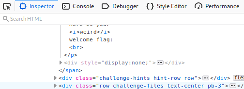
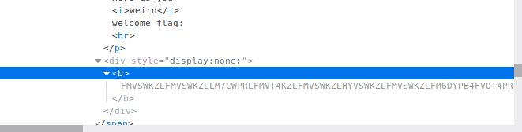
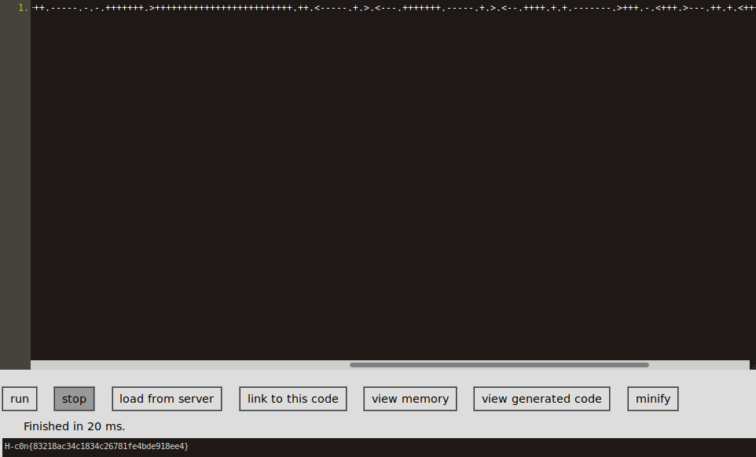

# Weird Sanity Check
> Welcome to h-c0n qualifier CTF 2020!
> Each flag will follow the format "H-c0n{" + MD5 + "}".

> Here is your weird welcome flag:

# Start
- Inspect element it :D (`F12`)  
Go to the **Here is your weird welcome flag:** section and there u can see the one `div` block with `style="display:none;"`  
  
- Just open it  
  
- We got a base32 encoded string  

```
FMVSWKZLFMVSWKZLLM7CWPRLFMVT4KZLFMVSWKZLHYVSWKZLFMVSWKZLFM6DYPB4FVOT4PR6FMVS4PBLFMVSWKZLFMVSWKZLFMVSWKZOHY7C2LR4HQVSWKZOHY7CWKZLFMVSWKZLFMVSWLRLFMVSWKZLFMVSWKZLFMVS4PB4FMVSWKZLFMVSWLRNFUWS2LJOFUXC2LRLFMVSWKZLFMXD4KZLFMVSWKZLFMVSWKZLFMVSWKZLFMVSWKZLFMVSWLRLFMXDYLJNFUWS2LRLFY7C4PBNFUWS4KZLFMVSWKZLFYWS2LJNFUXCWLR6FY6C2LJOFMVSWKZOFMXCWLRNFUWS2LJNFUXD4KZLFMXC2LR4FMVSWLR6FUWS2LRLFMXCWLR4FMVSWKZLFYWS2LJNFUWS2LJOFMVSWKZLFMVS4PROFY6C2LJNFUXD4PRLFMXA====
```

- Decode it with `echo "string" | base32 -d`  

```
echo "FMVSWKZLFMVSWKZLLM7CWPRLFMVT4KZLFMVSWKZLHYVSWKZLFMVSWKZLFM6DYPB4FVOT4PR6FMVS4PBLFMVSWKZLFMVSWKZLFMVSWKZOHY7C2LR4HQVSWKZOHY7CWKZLFMVSWKZLFMVSWLRLFMVSWKZLFMVSWKZLFMVS4PB4FMVSWKZLFMVSWLRNFUWS2LJOFUXC2LRLFMVSWKZLFMXD4KZLFMVSWKZLFMVSWKZLFMVSWKZLFMVSWKZLFMVSWLRLFMXDYLJNFUWS2LRLFY7C4PBNFUWS4KZLFMVSWKZLFYWS2LJNFUXCWLR6FY6C2LJOFMVSWKZOFMXCWLRNFUWS2LJNFUXD4KZLFMXC2LR4FMVSWLR6FUWS2LRLFMXCWLR4FMVSWKZLFYWS2LJNFUWS2LJOFMVSWKZLFMVS4PROFY6C2LJNFUXD4PRLFMXA====" | base32 -d
++++++++++[>+>+++>+++++++>++++++++++<<<<-]>>>++.<+++++++++++++++.>>-.<<+++.>>+++++++++++.+++++++++++++.<<++++++++.-----.-.-.+++++++.>+++++++++++++++++++++++++.++.<-----.+.>.<---.+++++++.-----.+.>.<--.++++.+.+.-------.>+++.-.<+++.>---.++.+.<+++++.--------.+++++++.>..<----.>>++.
```

- We got some weird code
- This is the **brainfuck** programming language  
We have to paste this code into a **brainfuck interpreter**.
I use an online one now.
- Used online [interpreter](https://copy.sh/brainfuck/)  
We paste the code in and hit ***run***  


# WE GOT THE FLAG
`H-c0n{83218ac34c1834c26781fe4bde918ee4}`
