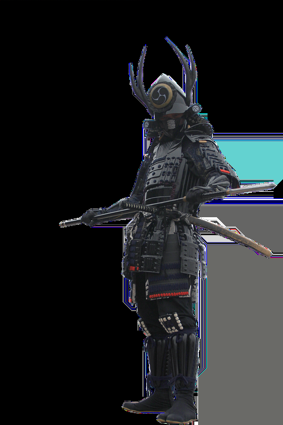
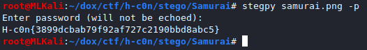

# Samurai
> "The general who is skilled in defense hides in the most secret recesses of the earth"
> Sun Tzu's Art of War

# What do we have
An image [samurai.png](samurai.png)  

# Start
- Its a stego challenge
- `binwalk -e samurai.png`
- We got a wav [file](binwalk/wind.wav)
- ITS A STEGOOOOOOO 
- We open the wav in `audacity`  
Open, change to spectogram mode. We can see a text `SHINOBI`.
## Now go back to the original image
- See whats the output of `exiftool samurai.png`
- We have the ***author*** `dhsdshdhk`  
Search for him. We can find his github page where he has 2 stego related repo. [stegpy](https://github.com/dhsdshdhk/stegpy) and [stego-toolkit](https://github.com/dhsdshdhk/stego-toolkit) which also includes stegpy.  
BTW we can download **stegpy** with `pip install stegpy`.
## Running stegpy and getting the juicy FLAAAG
- Run stegpy on *samurai.png*  
`stegpy samurai.png -p` enter the password that we got from the *wav* (`SHINOBI`) and we got our flag `H-c0n{3899dcbab79f92af727c2190bbd8abc5}`

# WE GOT IT AYYYYOOOO
