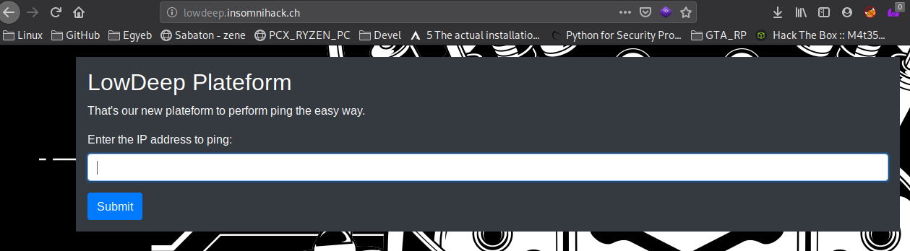
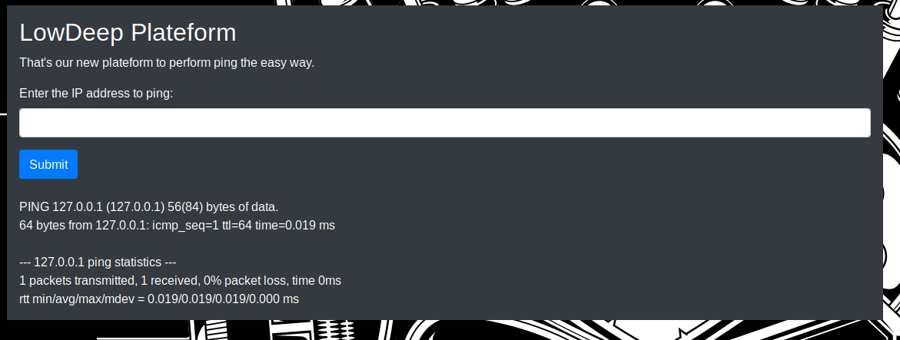
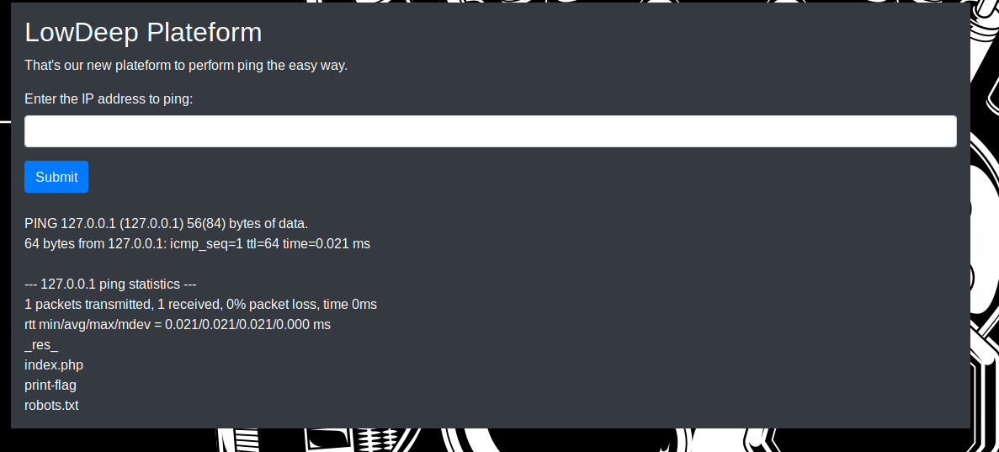
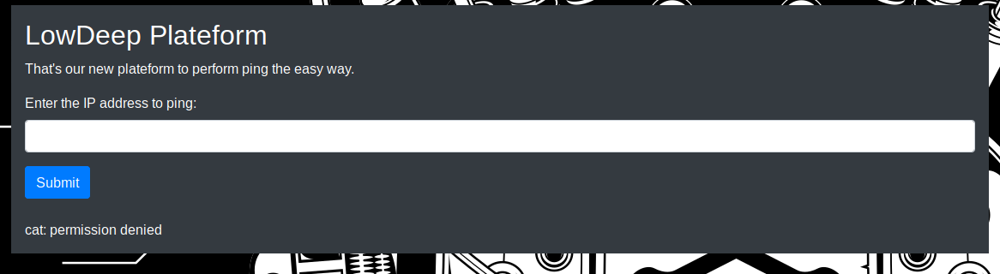

# [cd ../](../index.md)
# Web/LowDeep

> Try out our new ping platform: [lowdeep.insomnihack.ch/](http://lowdeep.insomnihack.ch)

# Start  

## Fuzzing
- Try `127.0.0.1` -> got a normal output of a `ping` cmd  

- Try `127.0.0.1;ls` -> got the whole directory ayy  

## Getting the flag
I tried a lotta thing to cat the flag but nothing works(I got a lotta permission denied on simple cmds like `cat`)  
  
- We have to do the other way  
The other way is that we know the filename on the server so just download it. :D  
Just go http://lowdeep.insomnihack.ch/print-flag  
- Download it
- We got the file [print-flag](print-flag)
- `strings print-flag`

# Got the flag 
`INS{Wh1le_ld_k1nd_0f_forg0t_ab0ut_th3_x_fl4g}`
