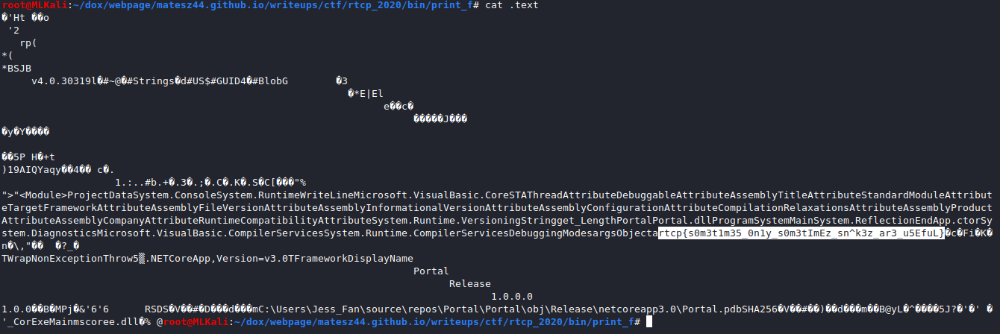

# [cd ../](../../index.md)
# print(f) to Pay Respects

## Descripion
> Lulu recently began to collect rice granules, she needs so many! (like over 9999) Jake says it might be a cure to Lulu's disease. Go help her get enough by throwing rice at the portal, print(f) to pay respects.

## Hint
> Careful not to throw rice in the wrong direction, just thow it close by (not into) the portal - Jake can pick it up later.

## Files
[Portal.zip](Portal.zip)

# Start
- Extract the zip
- Extract the `Portal.dll` file with  

```
7z x Portal.dll
```
- We got a `.text` file  
Lets see what's inside :D  
There is a lotta junk AND the **flag**

# Got it
```
rtcp{s0m3t1m35_0n1y_s0m3tImEz_sn^k3z_ar3_u5EfuL}
```
