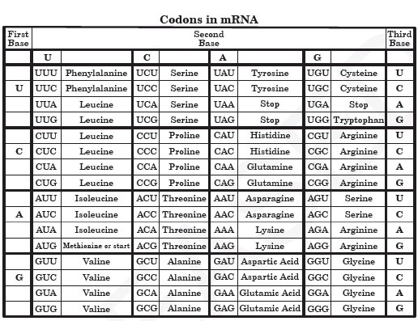

# [cd ../](../../index.md)
# Code On

## Description
> My houseplant and I were working on a biology assignment together. Yes, my houseplant. Don't question it. Anyways, she ended up giving me a new cipher to use in my next project! So I'm giving it to my biology friends to see if they can solve it. They are, after all, studying DNA and mRNA right now.
> AUGCAAGGUCUCUUGACCCAGUGGAUACUAAAUGCCUGGAAGGUAGCAUACUAG
> Key: 6, 3, 4, 3, 1, 9, 8, 3, 3, 2, 7, 4, 1, 2, 4, 1

## Hints
> Make sure to encase the plaintext with rtcp{} Spaces are represented by a underscore, (_)

# Start
- It's an **RNA** chain  

- We have to decrypt the long string with the image we found.
- Key numbers are the `n`-th character in the name of the whole *base*  
For example `UUU` is Phenylalanine and the key is `11` we get `i`.
- Decrypt the whole string with this technique and get the flag
- **DONT** include the ones that has `start` or `stop` in the name  

My manual decryption:  
```
RNA chain:

AUG CAA
GGU CUC
UUG ACC 
CAG UGG
AUA CUA
AAU GCC
UGG AAG
GUA GCA
 UAC UAG


Key: 

6, 3,
4, 3,
1, 9,
8, 3, 
3, 2, 
7, 4, 
1, 2, 
 4, 1


Included Start,stop:
ouculenyoegntyia

Without start, stop:
mycutehouseplant
```

# W3 G0T TH3 FL4G
```
rtcp{mycutehouseplant}
```
