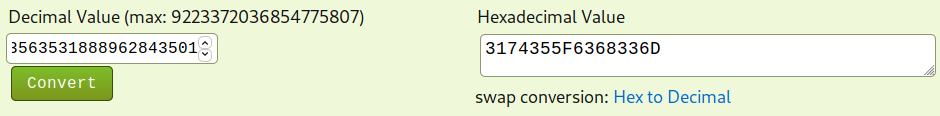
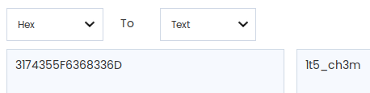

# [cd ../](../../index.md)
# Hump's Day, *1050 points*

## Description
> Happy Hump's Day  
> Happy TGIF!  
> Happy Saturday  
> Happy Tuesday +1  
> Happy Thursday +1  
> Happy TGIF -2  
> Happy Monday!  
> Happy Hump's day +5 3 times  
> Happy Saturday +3  
> Happy TGIF +1  
> Happy Tuesday +0  
> Happy Friday +3  
> Happy TGIF -1  
> Happy Wednesday  
> Happy TGIF  
> Happy Sunday  
> Happy Saturday -5  

## Hints
### First:
> flag is entered in the format `rtcp{tis_i_the_frenchiest_fry}`
### Second:
> Hump's day is on what day of this ctf?
### Third:
> The Lotus would be proud.
> Decimate your enemies, gather more hexenon, string the grineer up!
> simple. Isn't it?

# Lets start
- Sunday = 0
- Saturday = 6
- `Hump's Day` is *Wednesday* = 3
- `TGIF` is *Friday* = 5

## Converting the days to numbers
If we correctly convert it we have to get `3563531888962843501`. Now we have to convert it to hex then string as the hint says.  
Just search for a [decimal to hex converter](https://www.binaryhexconverter.com/decimal-to-hex-converter) and paste the number.  
  
And we have the hex `3174355F6368336D`.  
Now we have to convert it to text with a [hex to text converter](https://www.duplichecker.com/hex-to-text.php).  
  
And we got the flag text `1t5_ch3m`

# G07 17 4YYYYY
```
rtcp{1t5_ch3m}
```
