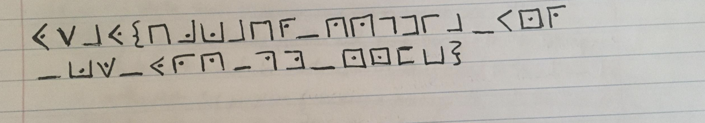

# [cd ../](../../index.md)
# Pandas Like Salads

> Did you know a new panda was added to the Washington DC zoo recently? Yep, apparently she really like salads. Interesting, yeah? Also, the panda keepers of the zoo said that the key to happiness in life is a little CUTENESS every day. You know, all the keepers who are on the panda's rotation all said the same thing to me. Very interesting.

# Files
[pandas_like_salads.png](pandas_like_salads.png):  


# Interesting
- `CUTENESS` - block caps
- `rotation` - mayb rot crypt

# Start
- This is [`Pigpen Cipher`](https://www.dcode.fr/pigpen-cipher)  
Decode it and we got
```
YSAY{HJKAHR_QQGDIA_UNR_KW_YRQ_PM_NNFB}
```

- It's [`vigniere cipher`](https://cryptii.com/pipes/vigenere-cipher) with some extra  
The extra is setting the key to `CUTENESS` and setting the variant to `Variant Beaufort cipher`.  
We got 
```
WYHU{UFSIFX_XMTZQI_STY_GJ_UZY_NS_UJSX}
```

- Now we need the [rot](http://theblob.org/rot.cgi?text=WYHU%7BUFSIFX_XMTZQI_STY_GJ_UZY_NS_UJSX%7D) from the hint
- We got the flag with `ROT-21`  


# GOT IT
```
RTCP{PANDAS_SHOULD_NOT_BE_PUT_IN_PENS}
```
