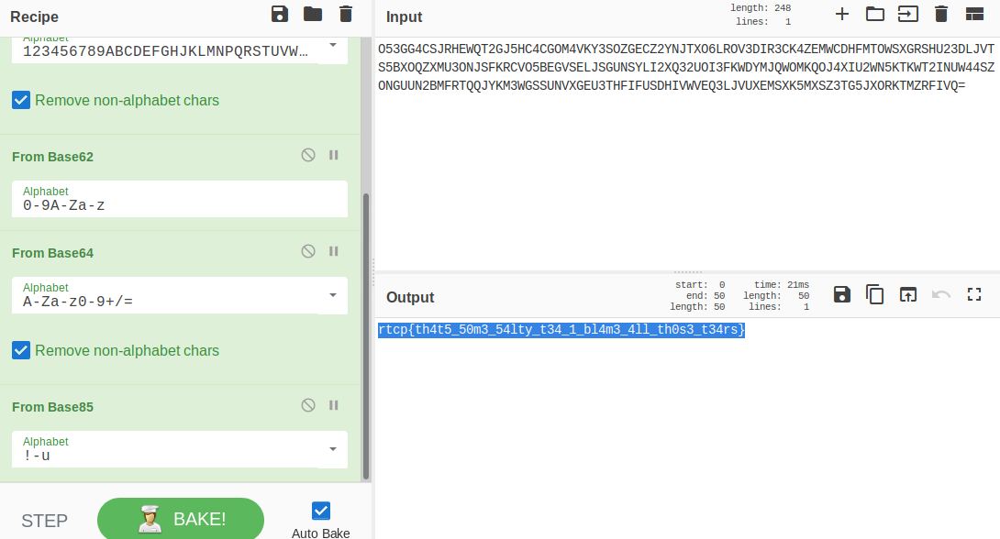

# [cd ../](../../index.md)
# That's Some Interesting Tea(rs).......

> You know, the tears of one's enemies works lovely in tea. Turns out, there's tons of different bases for tea. In fact, I think I heard Delphine talk about this chef website she used for her tea base combinations. . .

> Oh! Speaking of which, GIANt wants Delphine to make him tea. . . all he has is the tea leaves and the cup though. Maybe you can help Delphine, since she's really busy with cooking other things?

# The string we got
```
O53GG4CSJRHEWQT2GJ5HC4CGOM4VKY3SOZGECZ2YNJTXO6LROV3DIR3CK4ZEMWCDHFMTOWSXGRSHU23DLJVTS5BXOQZXMU3ONJSFKRCVO5BEGVSELJSGUNSYLI2XQ32UOI3FKWDYMJQWOMKQOJ4XIU2WN5KTKWT2INUW44SZONGUUN2BMFRTQQJYKM3WGSSUNVXGEU3THFIFUSDHIVWVEQ3LJVUXEMSXK5MXSZ3TG5JXORKTMZRFIVQ=
```

# Start
- Go to [CyberChef](https://gchq.github.io/CyberChef)
- Search for `base`  
And apply everything
```
base32
base58
base62
base64
base85
```


# Got it :D
```
rtcp{th4t5_50m3_54lty_t34_1_bl4m3_4ll_th0s3_t34rs}
```
