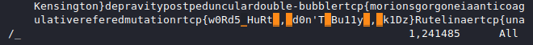

# [cd ../](../../index.md)
# Sticks and Stones

> may break my bones but words could never hurt me

# File that we got
[RTCP_GITHUB - worbz.txt](https://github.com/JEF1056/riceteacatpanda/tree/master/Sticks%20and%20Stones%20(50))  
[worbz.txt](worbz.txt)  
*btw thats one file lul*

# Start
- Open the file in vim
- Search for `_`  


# Got it
```
rtcp{w0Rd5_HuRt_,_d0n'T_Bu11y_,_k1Dz}
```
