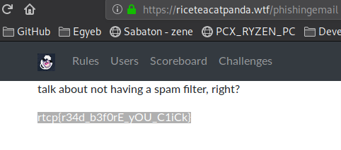

# [cd ../](../../index.md)
# Phishing for Flags

> I got a bunch of emails from people across the galaxy... some are more interesting than others.

## Files
- [Emails.zip](Emails.zip)


# Start
Unzip the `Emails.zip` file. Then grep for `riceteacatpanda` in every file and u will get the url u need.
```
grep "riceteacatpanda.wtf" *

GIVE ME BACK MY EYEHOLES.eml:<https://riceteacatpanda.wtf/phishingemail>
GIVE ME BACK MY EYEHOLES.eml:-MY <a href=3D"https://riceteacatpanda.wtf/phishingemail">EYEHOLES</a></div=
```
- We have the [url](https://riceteacatpanda.wtf/phishingemail) now  
So we go there and just copy paste the flag.  

# Got it
```
rtcp{r34d_b3f0rE_yOU_C1iCk}
```
