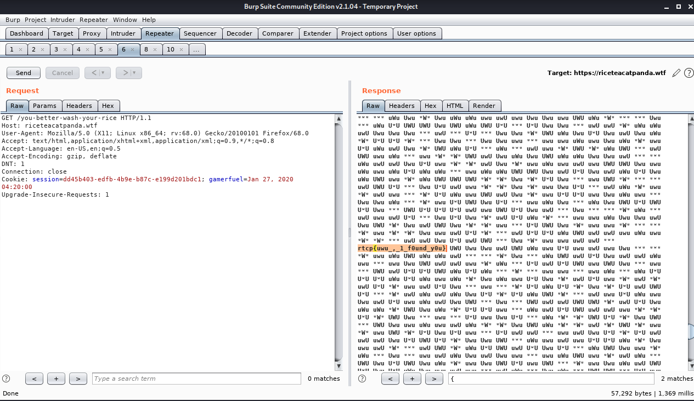

# [cd ../](../../index.md)
# Uwu?

> ᵘʷᵘ oh no ᵘʷᵘ ᵘʷᵘ ᵘʷᵘ ᵘʷᵘ ᵘʷᵘ ᵘʷᵘ ᵘʷᵘ ᵘʷᵘ ᵘʷᵘ ᵘʷᵘ hecc sorry guys ᵘʷᵘ ᵘʷᵘ ᵘʷᵘ ᵘʷᵘ ᵘʷᵘ ᵘʷᵘ ᵘʷᵘ ᵘʷᵘ sorry im dropping ᵘʷᵘ my uwus all over the ᵘʷᵘ place ᵘʷᵘ ᵘʷᵘ ᵘʷᵘ oh no I lost one ᵘʷᵘ ᵘʷᵘ ᵘʷᵘ ᵘʷᵘ ᵘʷᵘ ᵘʷᵘ ᵘʷᵘ

> ah, Jake, you idiot

## Pages we got
[https://riceteacatpanda.wtf/uwu](https://riceteacatpanda.wtf/uwu)  

# Start
- Go to the link  
Its redirecting soooo fast
- Open all redirect pages in burp repeaters and search for the flag format  
I searched here only for `{` and found it on [https://riceteacatpanda.wtf/you-better-wash-your-rice](https://riceteacatpanda.wtf/you-better-wash-your-rice)  


# Got the flag
```
rtcp{uwu_,_1_f0und_y0u}
```

