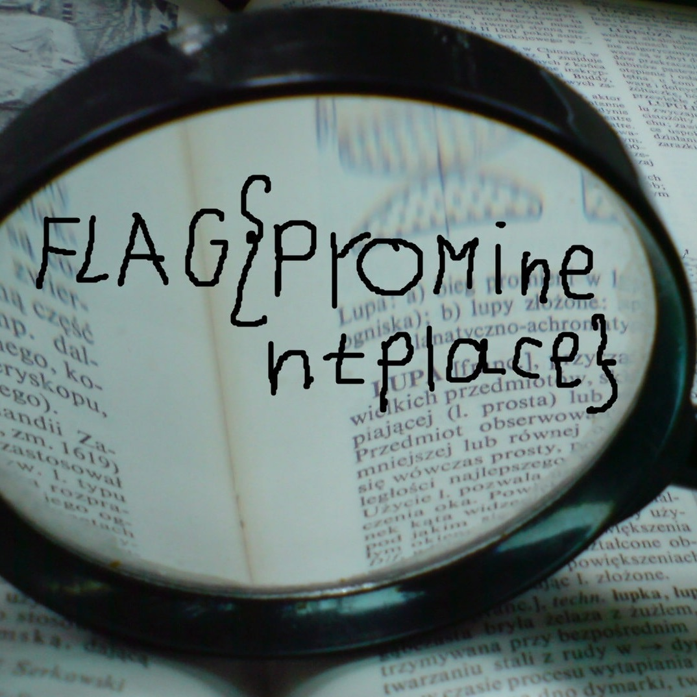
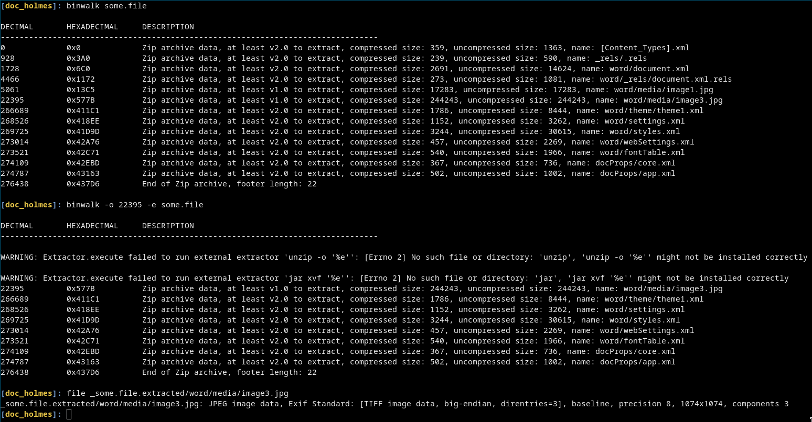

# [cd ../](../../index.md)
# Doc. Holmes
> Sherlock got it on his super secret channels. You have received a copy of mail. Is everything okay with it?

## Files
[some.file](some.file)

# ⬇ Start ⬇
`file some.file` returns its a doc file.  

## Binwalk
```
binwalk -e some.file
```
U can find the flag image under `_some.file.extracted/word/media/image3.jpg`  
Just open it and read the flag!  


## Issues with binwalk
If u have any issues (like me) with the version of binwalk and it returned to an error cuz of the empty **image2.jpg** u have to add an *offset* to binwalk.  
  
`22395` is where the **image3.jpg** file starts so we just skip the beginning with this flag
# Got the flag
```
FLAG{PrOMinentPlace}
```

