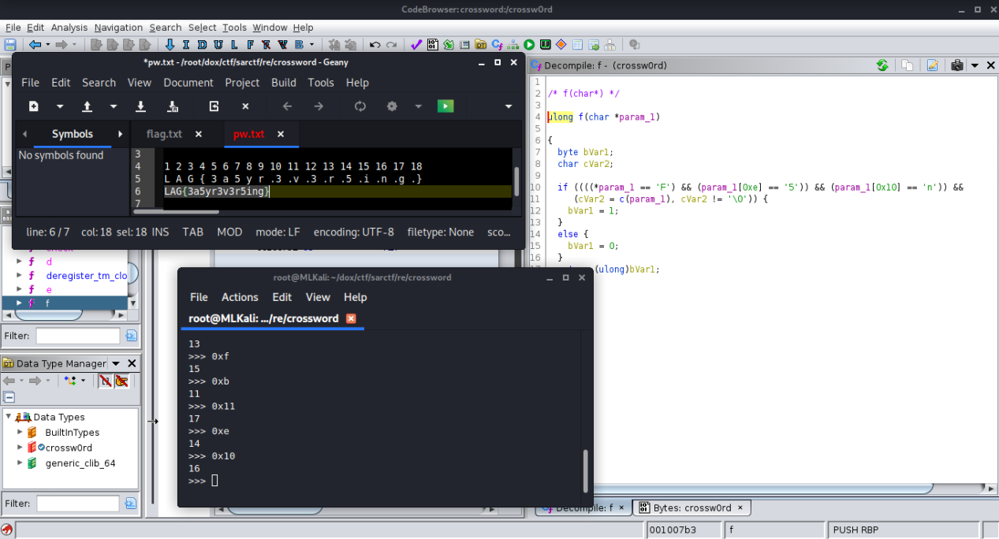

# [cd ../](../../index.md)
# Crossw0rd
> While the children were playing toys, Sherlock was solving crosswords in large volumes.

## Files
[crossw0rd](crossw0rd)

# ⬇ Start ⬇
- Its a linux executable.  
- Open it in ghidra
- Its checking the pw with functions ( `a-f` )
  - Just write down the checks  
  

# Got it :D
```
FLAG{3a5yr3v3r5ing}
```
