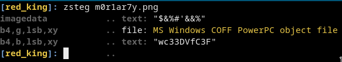
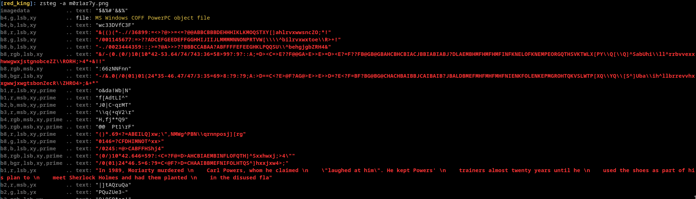
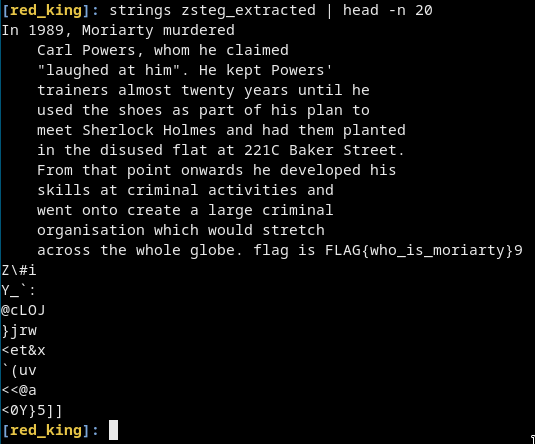

# [cd ../](../../index.md)
# Red King
> Just Moriarty? Really?

## Files
[m0r1ar7y.png](m0r1ar7y.png)

# ⬇ Start ⬇
We have a `.png` file there is some way to extract extra data from it.  
Like `exiftool`, `stegpy`, `zsteg` and much more!

## Zsteg
If we use zsteg on it with no extra flag we will get nothing.  
  
BUT we could use the `-a` flag to get everything from the file.  
```
zsteg -a m0r1ar7y.png
```
  
Now we got some interesting text in `b1,r,lsb,yx`!

> In 1989, Moriarty murdered \n    Carl Powers, whom he claimed \n    \"laughed at him\". He kept Powers' \n    trainers almost twenty years until he \n    used the shoes as part of his plan to \n    meet Sherlock Holmes and had them planted \n    in the disused fla

- We have to extract `b1,r,lsb,yx`
  
  ```
  zsteg -E b1,r,lsb,yx m0r1ar7y.png > zsteg_extracted
  ```
  [zsteg_extracted](zsteg_extracted)
- Just `strings` it and go to the beginning!

  ```
  strings zsteg_extracted | head -n 20
  ```
  

# Got the flag
```
FLAG{who_is_moriarty}
```
