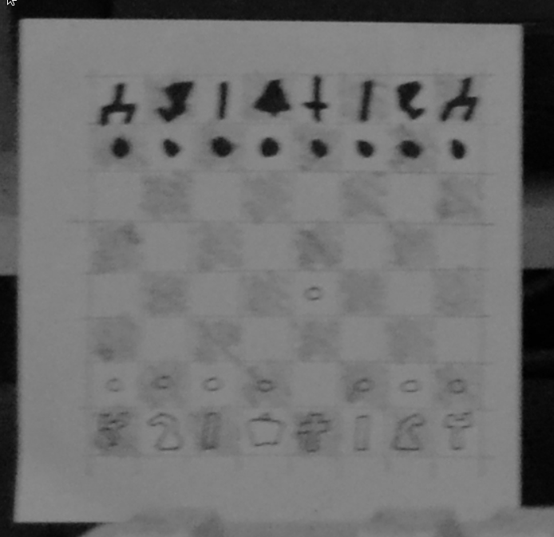

# [cd ../](../index.md)
# DESk

> They figured out my password, so I had to change it after 39 years. But now I can't remember my new one.

- We got ***2*** files. [login.jpg](login.jpg)  and [secret.zip](secret.zip)
- We have to get the ***pw of secret.zip*** somehow.

So we started googling and found that this start named `King's Pawn Game` on the little paper on the down left in the login picture.


And we found the [page](https://thehackernews.com/2019/10/unix-bsd-password-cracked.html)!

The password is `p/k2-k4!` for the zipfile and if we open it we got the flag.txt file that contained the flag.
```
             ________________________________________________
            /                                                \
           |    _________________________________________     |
           |   |                                         |    |
           |   |  $ cat flag.txt                         |    |
           |   |  TMHC{1_kn0w_d35cr1pt1v3_n0t4t10n}      |    |
           |   |  $ _                                    |    |
           |   |                                         |    |
           |   |                                         |    |
           |   |                                         |    |
           |   |                                         |    |
           |   |                                         |    |
           |   |                                         |    |
           |   |                                         |    |
           |   |                                         |    |
           |   |                                         |    |
           |   |_________________________________________|    |
           |                                                  |
            \_________________________________________________/
                   \___________________________________/
                ___________________________________________
             _-'    .-.-.-.-.-.-.-.-.-.-.-.-.-.-.-.-.  --- `-_
          _-'.-.-. .---.-.-.-.-.-.-.-.-.-.-.-.-.-.-.--.  .-.-.`-_
       _-'.-.-.-. .---.-.-.-.-.-.-.-.-.-.-.-.-.-.-.-`__`. .-.-.-.`-_
    _-'.-.-.-.-. .-----.-.-.-.-.-.-.-.-.-.-.-.-.-.-.-----. .-.-.-.-.`-_
 _-'.-.-.-.-.-. .---.-. .-------------------------. .-.---. .---.-.-.-.`-_
:-------------------------------------------------------------------------:
`---._.-------------------------------------------------------------._.---'
```
