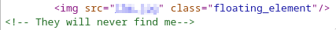
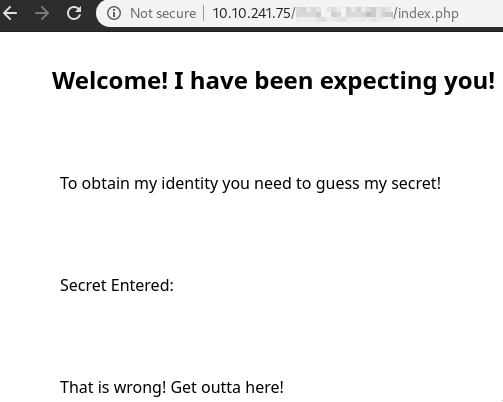
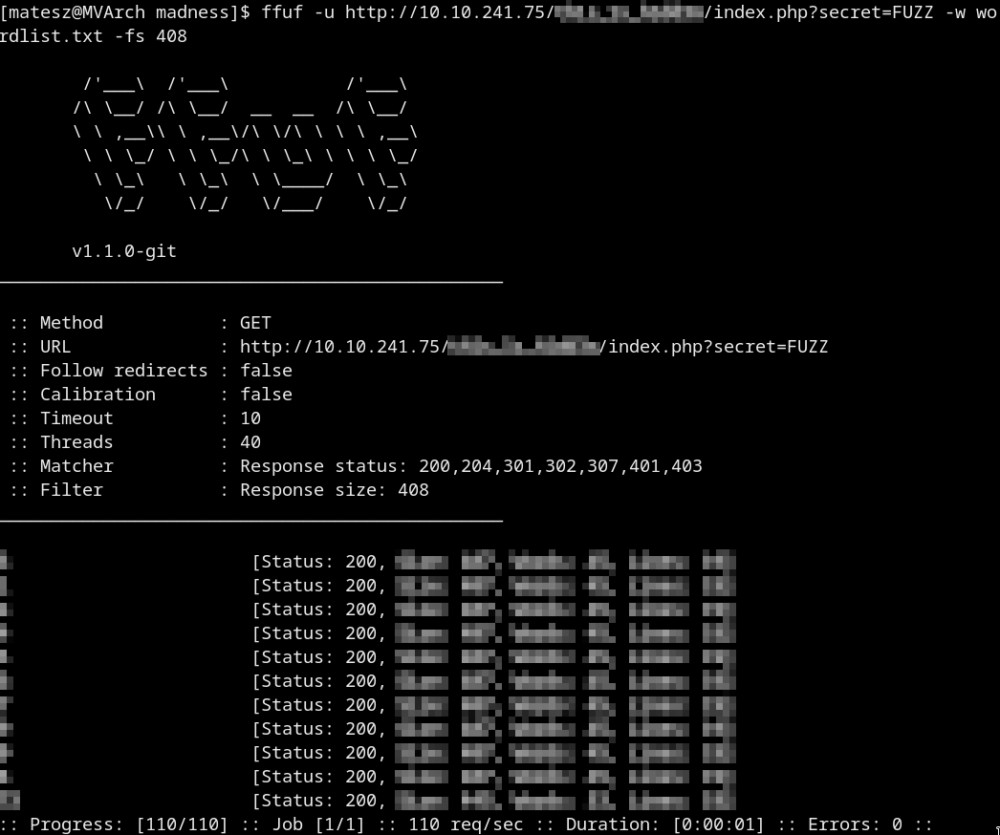
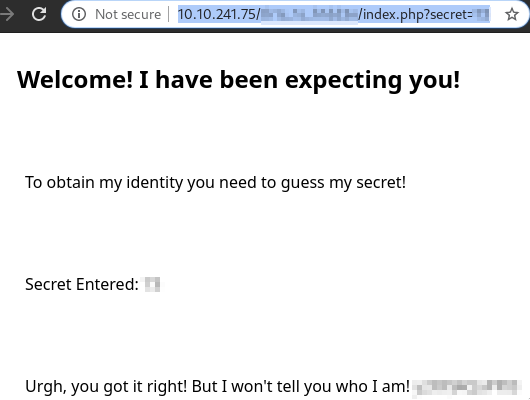
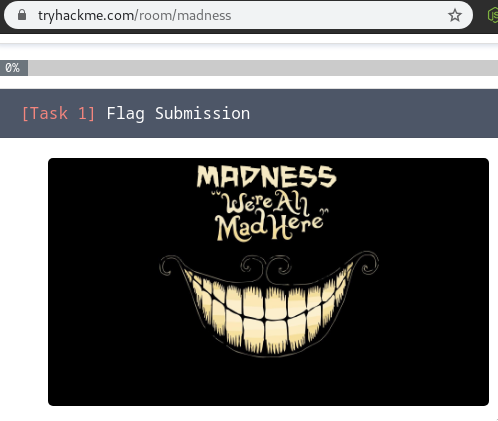

# Madness
> Will you be consumed by Madness?

# Start
## Recon

### Nmap
Open ports are:
- 22
- 80

### Web
Source:  
  

#### Img enum
`<name>.jpg` but `png` *magic bytes*  
Replace with `hexedit` to jpg ones!  
If we open it we got a hidden dir in the web server!  

#### Guessing the secret on the hidden page
  
We need to guess a `?secret=<number>` on the secret page  
Take a look at the source!  
We got the secret is between `0` and `99`  
Create a wordlist with crunch!
```
crunch 1 2 0123456789 > wordlist.txt
```
And  use `ffuf` to brute it!
  
```
ffuf -u http://10.10.241.75/<secret dir>/index.php?secret=FUZZ -w wordlist.txt -fs 408
```
- We got the secret!  
Go there and u will find a pw  
  
- Use steghide with this pw on the hexedited image and we got the *username*!  
  This seems weird so run a `rot13` on it and we got the **real** username!!!!  
We need a pw now!  
Go to the main page of the box and download the image from there!  
  
- Use steghide without any pw and we got the pw!

## Ssh
Log in with the username and the pw we got from the imgs with steghide!
### We got the `user.txt`
### Privesc
Run `linenum`  
We got there is a vulnerable version of *gnu screen* on the machine!!  
```
/bin/screen-4.5.0
```
We have to search for an [exploit](https://www.exploit-db.com/exploits/41154) for screen

# Got root and `root.txt`
