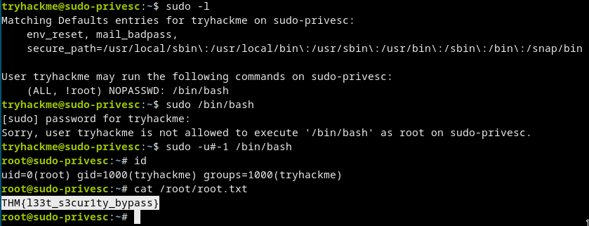

# [cd ../](../index.md)
# Sudo Security Bypass
> A tutorial room exploring CVE-2019-14287 in the Unix Sudo Program. Room One in the SudoVulns Series

# Start
> Now it's your turn.

> SSH into that machine you deployed earlier, using port 2222.

> The credentials are:

> Username: tryhackme  
> Password: tryhackme

> If you're using Linux, the command will look like this:

> `ssh -p 2222 tryhackme@<remote-machine-ip>`

# Proof

