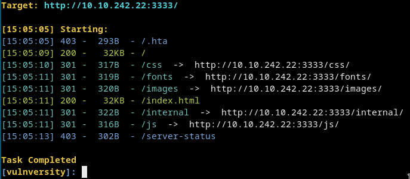
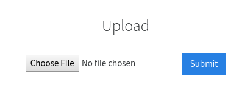
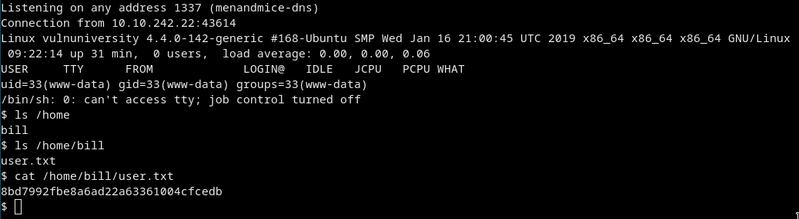
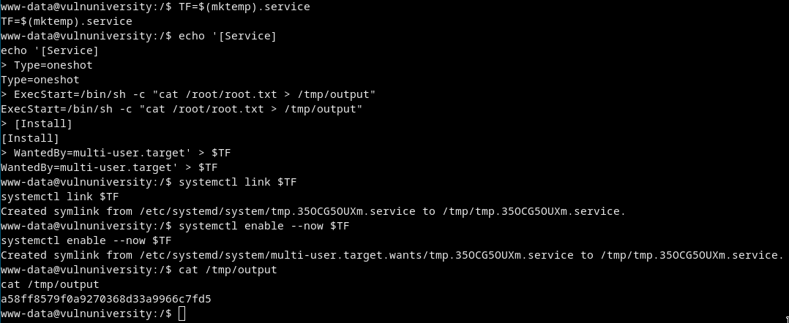

# [cd ../](../index.md)
# Vulnversity
> Learn about active recon, web app attacks and privilege escalation.

# Start

## Enumeration
### Nmap
[nmap](nmap.txt)  
Open ports are:  
- 21 - vsftpd 3.0.3
- 22 - ssh
- 139 - smb
- 445 - smb
- 3128 - Squid http proxy 3.5.12
- 3333 - Apache httpd 2.4.18 ((Ubuntu))

### Dirsearch
  
There is `/internal` this is a file upload page  


## Trying to get a shell
- Some exensions are blocked like `.php`
  Fuzz what we can upload.  
  We could upload `.phtml`

- Just rename a default `php-reverse-shell.php` to `anything.phtml`  
  Upload it!  
  But we dont know where it is.  
  Dirsearch again in `/internal`  
  There is `/internal/uploads`  
  Go to `/internal/uploads/php-reverse-shell.phtml`  
  And we GOT THA SHELL
  ```
  cat /home/bill/user.txt
  ```
  And we got the user flag too.
  

## Privesc
- Search for suid's

  ```
  find / -perm /6000 2>dev/null | grep bin
  ```
  `/bin/systemctl` stands out maybe we can use it to get root  
  [GTFOBins](https://gtfobins.github.io/gtfobins/systemctl/#suid)  
  Use it and cat `/root/root.txt` to `/tmp/output`  
  
