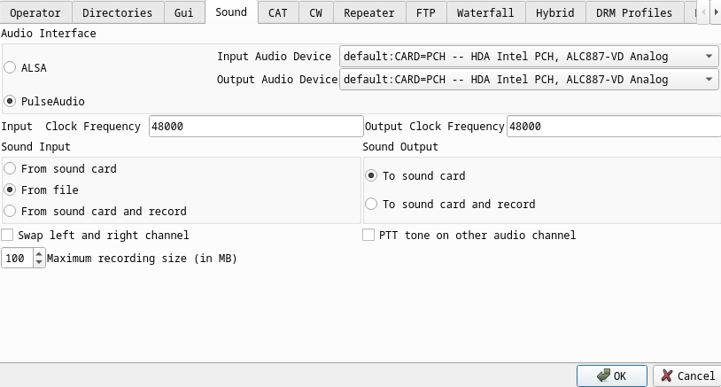
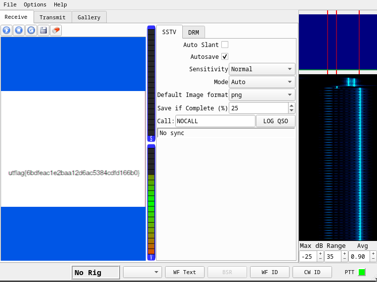

# [cd ../](../../index.md)
# 1 Frame per Minute
> I recently received this signal transmission known as SSTV in a mode called Martian? This technology is all very old so I'm not sure what to do with it. Could you help me out?  
> by phleisch

## Files
[signals.wav](signals.wav)

# Start
Open `qsstv`
Options -> Configuration -> Sound -> **Sound Input** -> ***From file***
  
And open the wav!  


# Got it!
```
utflag{6bdfeac1e2baa12d6ac5384cdfd166b0}
```
