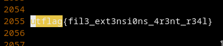

# [cd ../](../../index.md)
# [basics] forensics
> My friend said they hid a flag in this picture, but it's broken! Now that I think about it, I don't even know if it really is a picture...  
> by balex  
> PTS: 50

## Files
[secret.jpeg](secret.jpeg)

# Start
```
file secret.jpeg
```
It returns its a unicode text
```
vim secret.jpeg
```
And search for `utflag`


# Got it
```
utflag{fil3_ext3nsi0ns_4r3nt_r34l}
```
