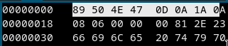

# [cd ../](../../index.md)
# The Legend of Hackerman, Pt. 1
> My friend Hackerman tried to send me a secret transmission, but I think some of it got messed up in transit. Can you fix it?  
> by balex  
> PTS: 50

### Files
[hackerman.png](hackerman.png)

## Start
Change the [magic bytes](https://en.wikipedia.org/wiki/List_of_file_signatures) to `png` ones  
(`89 50 4E 47 0D 0A 1A 0A`) with `hexedit`!  
  
Open the png image

# Got the flag
```
utflag{3lit3_h4ck3r}
```

# The Legend of Hackerman, Pt. 2
> Ok, I've received another file from Hackerman, but it's just a Word Document? He said that he attached a picture of the flag, but I can't find it...  
> by balex  
> PTS: 50

### Files
[Hacker.docx](Hacker.docx)

## Start
We have to **extract** the `docx` file
```
binwalk -e Hacker.docx
sxiv _Hacker.docx.extracted/word/media/*
```
And just run through all with pressing `n`  
The flag is in `image23.png`

## Got it
```
utflag{unz1p_3v3ryth1ng}
```
