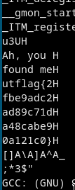

# [cd ../](../../index.md)
# Observe Closely
> A simple image with a couple of twists...  
> by phleisch  
> PTS: 50

## Files
[Griffith_Observatory.png](Griffith_Observatory.png)

# Start
```
binwalk -e Griffith_Observatory.png
cd _Griffith_Observatory.png.extracted
strings hidden_binary
```
  
 Those `H` are weird so remove them and remove the linebreaks too and we got the flag!

# Got it
utflag{2fbe9adc2ad89c71da48cabe90a121c0}
