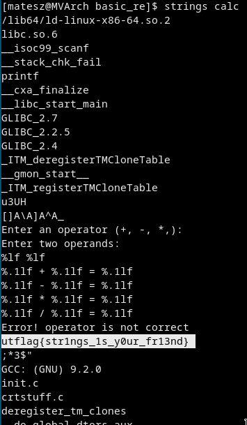

# [cd ../](../../index.md)
# [basics] reverse engineering
> I know there's a string in this binary somewhere.... Now where did I leave it?  
> by balex
> PTS: 50

## Files
[calc](calc)

# Start
Just run `strings` on it!  


# Got it
```
utflag{str1ngs_1s_y0ur_fr13nd}
```
