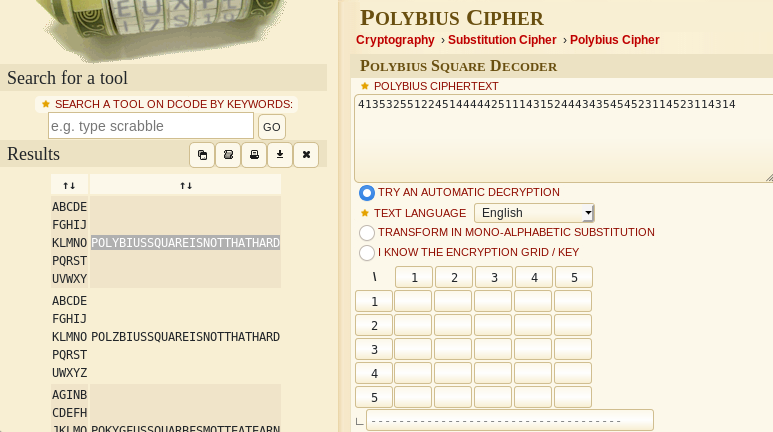
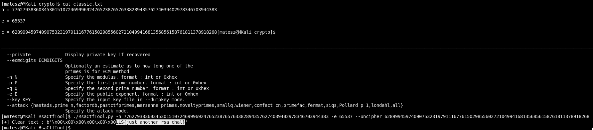
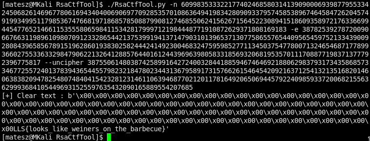
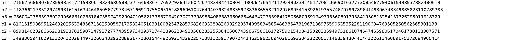
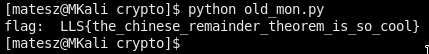

# Crypto challenges

## Polybius
We got a file [`polybius.txt`](polybius.txt)
- search for polybius on [dcode.fr](https://www.dcode.fr/en)  
  [Polybius Cipher](https://www.dcode.fr/polybius-cipher)
  - tick *Try an automatic decryption* to brute it :D
- just paste in what we have and click decrypt!  
  The first result is actually the flag :D  
    
  `LLS{POLYBIUSSQUAREISNOTTHATHARD}`

---

## Classic
We got [`classic.txt`](classic.txt) and n, e, c inside this file
- this is rsa!  
[RsaCtfTool](https://github.com/Ganapati/RsaCtfTool)
```
./RsaCtfTool.py -n 77627938360345301510724699969247652387657633828943576274039402978346703944383 -e 65537 --uncipher 62899945974090753231979111677615029855602721049941681356856158761811378918268
```
And we got the flag: `LLS{just_another_rsa_chal}`  


---

## Hot Dog
We got [`hot_dog.txt`](hot_dog.txt) and n, e, c again...
- rsa again :D
```
./RsaCtfTool.py -n 609983533322177402468580314139090006939877955334245068261469677806169434040069069770928535701086364941983428090933795745853896746458472620457491993499511798536747668197186857850887990812746855062415626715645223089415186093589721763366994454776521466115355580659841153428179997121984448771910872629371808169183 -e 387825392787200906676631198961098070912332865442137539919413714790310139653713077586557654409565459752133439009280843965856789151962860193830258244424149230046832475959852771134503754778007132465468717789936602755336332984790622132641288576440161244396963980583318569320681953570111708877198371377792396775817 --uncipher 387550614803874258991642724003284418859467464692188062983793173435868573346772557240137839436544557982321847802344313679589173157662615464542092163712541321351682014606383820947825480748404154232812314611063946877021201178164920650694457922409859337200682155636299936841054496931525597635432090165889554207685
```
And we got it again :D `LLS{looks_like_weiners_on_the_barbecue}`  


---

# Old monitor
We got an image [`old_monitor.png`](old_monitor.png)  


`n1, n2, n3, c1, c2, c3`
- John loves rsa xD

Now there is a script my teammate grabbed from the net and modified a lilbit :D  
[1337 H4x0r RSA cR4Ck3r 5Cr1p7](old_mon.py)  
```
python2 old_mon.py
```
And there is the flag!  
`LLS{the_chinese_remainder_theorem_is_so_cool}`  

