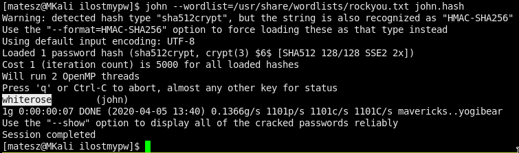

# Forensics challenges

## I Lost My Password!
We got 2 files [passwd](ilostmypw/passwd) and [shadow](ilostmypw/shadow)  
Inside the shadow file we have user `john` and his hash that we must crack!
- Let's use john for john!  
  

First of all, let's save the hash line to an other file like [`john.hash`](ilostmypw/john.hash)!
Then start john!
```
john --wordlist=/usr/share/wordlists/rockyou.txt john.hash
```
  
And we got john's pw `whiterose` so the flag is `LLS{whiterose}`

---

## Tragic Number
We got a file [`tragic_number.zip`](tragic_num/tragic_number.zip)
- run file it returns it's a zip archive
- unzip it with `7z x tragic_number.zip` we got an error that it isnt an archive!
  - Maybe something fucked up with the [magic numbers](https://en.wikipedia.org/wiki/List_of_file_signatures)  
    Open in hexedit and edit the magic numbers at the beggining to the zip ones(`50 4B 03 04`)
    ```
    cp tragic_number.zip tragic_number_fix.zip
    hexeditor tragic_number_fix.zip
    ```
    Write `504B0304` and hit ctrl+x and enter to save it!
- Now unzip it!  
  We got [`flag.txt`](tragic_num/flag.txt) and the flag inside the file!
  ```
  LLS{tragic_number_more_like_magic_number}
  ```
