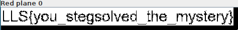
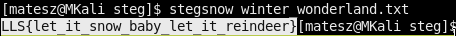
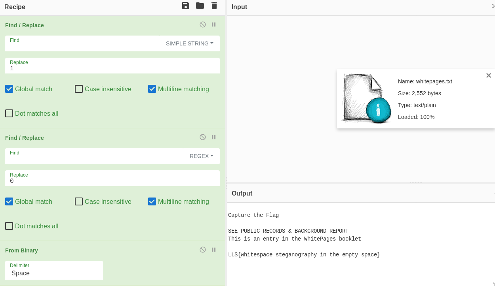

# Stego challenges

## Stegosaurus
We got a file [`stegosaurus.png`](stegosaurus.png) this is a simple png file nothing special in the strings output. :(  
Let's use some 1337H4x0r scripts like [`stegsolve.jar`](https://www.wechall.net/de/forum/show/thread/527/Stegsolve_1.3/)  
Open the image we got in stegsolve and just *click click click* until we reach the `red plane0`!  
  
and we got the flag :D  
`LLS{you_stegsolved_the_mystery}`

---

## Winter wonderland
It's only a txt file and idk why but it's winter related ?XD
- Somehow we found the tool `stegsnow` with the power of google :D
- run it on the file `stegsnow winter_wonderland.txt` and we got the flag!  
  

---

## WhitePages
We got a file([`whitepages.txt`](whitepages.txt)) filled with spaces!
- cyberchef is our friend!  
  
  `LLS{whitespace_steganography_in_the_empty_space}`
