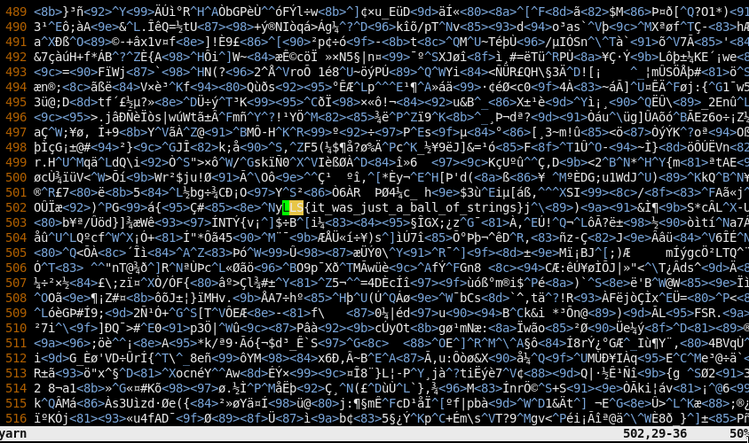

# Warmup challenges

## Read the rules
Just go to [`/rules`](https://ctf.virseccon.com/rules) and hit ctrl+u to view the source!  
*heavy scrolling*  


---

## Believe in your eyes
We got a file [`believe_your_eyes.rar`](believe_your_eyes.rar)
- run `file believe_your_eyes.rar` and we got it's a png image!
- Open it in a picture viewer!  
    
  `LLS{if_ten_million_fireflies}`

---

## Puppo
We got a file [`woofer.jpg`](woofer.jpg)
- run `exiftool woofer.jpg` on it  
    
  We got a weird comment
- try to decrypt as base64!  
  `echo "" | base64 -d`  
    
  and we got the flag `LLS{doggo_says_such_base64_very_wow}`!

---

## Yarn
We got a file [`yarn`](yarn)
- run `file yarn` and we got it's data...
- open it in `vim` and search for the flag format `LLS`!  
    
  and there is the flag `LLS{it_was_just_a_ball_of_strings}`

---

## DotCom Scavenger Hunt
We got a file [`dotcom_scavenger_hunt.zip`](dotcom_scavenger_hunt.zip)
- run `file dotcom_scavenger_hunt.zip` we got it's a zip archive!
- unzip it! `7z x dotcom_scavenger_hunt.zip` and we have the `nothinginthebox.com` directory now :)

This is a website source and we have a flag hidden somewhere!  
Since we have the source and the flag format we could easily grep for it :D
```
grep -ro "LLS{\w*}" nothinginthebox.com/
```
And we got it!!  
  
`LLS{just_find_it_with_grep}`

---

## Pack'd
We got a file [`packd`](packd)
- run file and strings on it and the first line of strings is `'UPX!`. This could be packed with the program `upx`!
- unpack it with `upx -d packd -o packd_unpacked`  
  Now, we have a [packd_unpacked](packd_unpacked) file too :D
- run strings and grep for the flag!  
  Gotcha baby!  
  `LLS{packing_an_executable_can_hide_some_data}`

Full process:  


---

## Capture the flag!
We only got a youtube link [youtube.com/watch?v=Nh23tQ8MD-Q](https://www.youtube.com/watch?v=Nh23tQ8MD-Q)
- It's a 6 sec vid so maybe the flag is in a frame!
- Open the video in mpv
  ```
  mpv https://www.youtube.com/watch?v=Nh23tQ8MD-Q
  ```
  and use `.` to the next frame and use `,` to go backwards one frame!
- Around 4 sec we hit a frame where the flag is printed!  
    
  `LLS{flags_in_frames_forever}`
